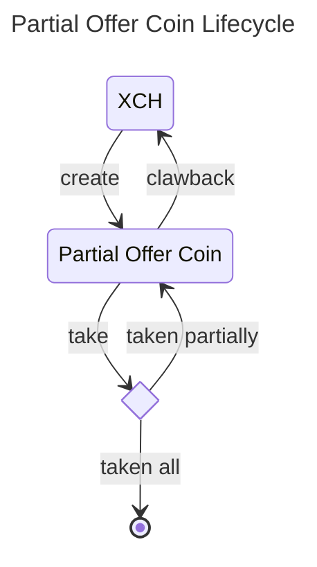

# Partial Offer Coin (PoC)

A dexie partial offer coin is a coin with a puzzle offering one asset (XCH only for now) for another CAT at a fixed exchange rate. A maker can use partial cli to create an offer. The offer can be taken using partial cli and an optional standard Chia offer. The offer can also be clawed back by the maker at any time.

# Design Decisions and Overview
- The partial offer coin is a coin on the blockchain.
- The first partial offer is created by using `partial create` command. When the first offer is created, no new coin is created. The first partial offer coin is created and spent when the offer is taken.
- A file containing partial offer information is a non standard bech32 offer file with partial coin spend. The first partial offer also contains the standard transaction coin spend that creates the first partial offer coin.
- The partial offer can be taken by using `partial take` command.
- When the partial offer is taken partially, the new partial offer coin with the new amount is created.
- The [standard settlement (offer) puzzle](https://chialisp.com/offers/) is utilized to ensure that the assets are exchanged.
- The total amount on the partial offer can be clawed back to the maker by using `partial clawback` command.

# Chialisp

- [partial.clsp](./partial_cli/puzzles/partial.clsp) - The partial offer coin puzzle.
- [fns.clsp](./partial_cli/puzzles/fns.clsp) - The helper functions for the partial offer coin puzzle.

## Parameters
```lisp
  (
        MOD_HASH                ; self puzzle hash 
        FEE_PH                  ; puzzle hash that will receive the fee
        FEE_RATE                ; fee rate (0-10000), e.g., 1% is represented as 100
        MAKER_PH                ; maker puzzle hash (both receive and clawback)
        MAKER_PK                ; maker public key used in clawback case
        TAIL_HASH               ; request CAT tail hash
        RATE                    ; number of CAT per XCH, e.g., 1 XCH = 100 CATs, rate = 100000
        partial_coin_amount     ; amount of partial offer coin
        coin_id                 ; coin id of the partial offer coin
        taken_mojos_or_clawback ; amount of XCH mojos taken, or 0 if clawback
        clawback_fee_mojos      ; blockchain fee in mojos, used in clawback case
  )
```
# Partial CLI commands
```bash
❯ partial --help

 Usage: partial [OPTIONS] COMMAND [ARGS]...

 Manage dexie partial offers

╭─ Options ─────────────────────────────────────────────────────────────────────────────────────────╮
│ --help      Show this message and exit.                                                           │
╰───────────────────────────────────────────────────────────────────────────────────────────────────╯
╭─ Commands ────────────────────────────────────────────────────────────────────────────────────────╮
│ clawback   clawback the partial offer coin.                                                       │
│ config     display the cli config                                                                 │
│ create     create a partial offer requesting CAT token                                            │
│ get        get a serialized curried puzzle of the partial offer coin                              │
│ show       display the dexie partial offer information.                                           │
│ take       Take the dexie partial offer by providing the taker offer file or request information. │
╰───────────────────────────────────────────────────────────────────────────────────────────────────╯
```

## Sample
### Create
> Offer 1 XCH for 714.28 DBX
```bash
❯ partial create -f $partial_fp --offer 1:1 --request db1a9020d48d9d4ad22631b66ab4b9ebd3637ef7758ad38881348c5d24c38f20:714.28
{
  "partial_info": {
    "fee_puzzle_hash": "bc1f6e34fbc556d279b2e2187f2b7271df540926f21f74e26ba212c78a56b9b9",
    "fee_rate": 100,
    "maker_puzzle_hash": "f3ef546a82ed460b966d72b2ca5d39711eb3daf1b3c372aa82d0071c21feffbc",
    "public_key": "854500d2d9b4519e5e4a763d659f0bef63c96afe8437230f5c90ae6915a5acf631f37ba5d599ac957a23b4da4b5c34d1",
    "tail_hash": "db1a9020d48d9d4ad22631b66ab4b9ebd3637ef7758ad38881348c5d24c38f20",
    "rate": 714280
  },
  "partial_coin": {
    "parent_coin_info": "0x27387932fb360a2502ec6e4c06c1bb11ca48e50fd40ac2651db17f72bb34ccc3",
    "puzzle_hash": "0x81966fee00e7dd9f6b7fec3e5116add8abd6865438b44513924c10450f8982c9",
    "amount": 1000000000000
  },
  "launcher_coin": {
    "parent_coin_info": "0x8e9a00ad2ff9c5b81da91e9b16d17237c0582d23e70c4f8ec5784f7c36b75520",
    "puzzle_hash": "0xf3ef546a82ed460b966d72b2ca5d39711eb3daf1b3c372aa82d0071c21feffbc",
    "amount": 1000000000000
  },
  "offer": "offer1qqr83wcuu2rykcmqvpsw4x79kpt0le73rkezhetx3dwjcv3lzzs6hlyuc7l776y907xanajssh877sajnt0t5u20evka5ap266e9qmhn4k8ekrch444t4spw50uwllc75qvjlt3vz4sgpd6nsla3cd7cuqxn63vkdtl2d97dedjj5ntaumvjcyvluclw8k0eagfs90ekaem0uf7g4rc445lcklwtd0v2rwvtk65ln4gqw6c9rvyweap0pq44keajtd2yt984ueh6dsmeekaruryjz0m94vn749977920llg4krj5dr787s0rkn78wrx0al8vltnlvvtj3dhkcm4xkmfpzed4epf8lyyt3unhx6wlehcxp9atpl74954g6l5mwx5n90wf7dsnhwzm7z2vw5l79dwgw5n9xltp0mfk89ee3yrptr3pry44ry7kz7ga49kpdpgkfygt2wngch5h733htrsstjmjeq3ehyqzs9sn75spq72tqsg5nhgwvxav6pp3n92zech6qv5pr0wxcyzzfggz3ef9ytfc88r9pshueu0gg89v4zzzz42pvzvzgvq63tspjxx4zec2le3lfx0rj87s4tfx2rxyr9z6zqe3nyd6hh5xxv2gyepfhdhz3paqryfcl73mtfqy2q93skpxszjweluv9sxjssjgx2xtpf3vfz2pkfk7sqwraupkqz9yvfnug6ezyfy3mhrquacm2swagpnyfdc72es39ju4jpxf6lv8xv62gxzefpkpctp0lgfrhds2hcrrqrf8pveqg2cdu83t5ndcljy3llg6tqra6cr8pcch6facw9yrzgy9kxghnrhlh88s466az7xmmny2szdega3pn4c8nr846xcckuemq6mh3kk9v925m8ulma77cmuzewn8e0742c08d8h76f2k56ej702mmpchrnhnldl3gtelgu9y0msxj3qz26qr2ftyxrjqtz9gdft3gjr3w3ulz60d0zr59c449htvpjxsx3xskq38jq3jmjr7qvhvglnvvgmn7jgnncsdhzpg29f4zu3v4wsx4sjekvwzgkpfpws25kzrzs55xrswuxj2nqsp2fh63q3gf5gyz2nq66q9cplmgm9auq5ek64qm2uuywm8kd3awn97xx277nym7hfzl2ejxc4w7lcmh8hucp3t4zermuney6lclpja4tw0gj9zt6a63ur7pzna5flejfranzuy3emctmwup9gevqj4fk58ap7kw7k6uryhdehqn8qhua2kdxe6nlahmukf43ljmek2lsc384n93gh9mu7d7pelt54tx0t5et2jmeevkw7xus3dfaxm2gf3fth5em6m4frxhqkkhj7w67te86a7jam9mmngxn5cj4fems8knlf3xeenm5cqlyf35pda9x53txdf7yzcj3f9nxynjrgmtffnl3gupx87cenenj0hfgzefckawt8vdwncse55eqfw2u509l89ndul0fn8aj4se25auh43sq45g405expztllz26ezjmz3ft29hd3acvs6sv036q2u87ez3x8xnfktpe70k8dcxrstrnl4pqecxeu60wjfjxcqkt2jrxgks9xqq"
}
```
```bash
❯ partial show  ./launcher.offer
╭──────────────────────────┬────────────────────────────────────────────────────────────────────╮
│ MOD_HASH:                │ 0xe506255126ce71dccd6b5dac93d8950ecc863ba5f4aa68b123bfed59beccb03a │
│ Valid:                   │ Yes                                                                │
│ Partial Offer Coin Name: │ 0x7c41e1d31f3a75e2ac282997162f589de56926d0552cf87c47e7978af59910cf │
├──────────────────────────┼────────────────────────────────────────────────────────────────────┤
│ Total Offer Amount:      │ 1.0 XCH                                                            │
│ Total Request Amount:    │ 714.28 CATs                                                        │
│ Request Tail Hash:       │ 0xdb1a9020d48d9d4ad22631b66ab4b9ebd3637ef7758ad38881348c5d24c38f20 │
│ Rate (1 XCH):            │ 714.28 CATs                                                        │
│ Fee Recipient:           │ xch1hs0kud8mc4tdy7djugv872mjw804gzfx7g0hfcnt5gfv0zjkhxus4ugkkf     │
│ Fee Rate:                │ 1.0%                                                               │
╰──────────────────────────┴────────────────────────────────────────────────────────────────────╯
```

#### Curried Parameters
```lisp
(
  ; MOD_HASH 
  0xe506255126ce71dccd6b5dac93d8950ecc863ba5f4aa68b123bfed59beccb03a
  ; FEE_PH 
  0xbc1f6e34fbc556d279b2e2187f2b7271df540926f21f74e26ba212c78a56b9b9
  ; FEE_RATE   
  100                                                               
  ; MAKER_PH 
  0xf3ef546a82ed460b966d72b2ca5d39711eb3daf1b3c372aa82d0071c21feffbc
  ; MAKER_PK
  0x854500d2d9b4519e5e4a763d659f0bef63c96afe8437230f5c90ae6915a5acf631f37ba5d599ac957a23b4da4b5c34d1   
  ; TAIL_HASH (TDBX) 
  0xdb1a9020d48d9d4ad22631b66ab4b9ebd3637ef7758ad38881348c5d24c38f20
  ; RATE (1XCH -> 714.28 DBX, 714280)
  0x0ae628
) 
```

### Taken 
```bash
❯ partial take -f $partial_taker_fp -a $(0.2e12) ./launcher.offer
╭──────────────────────────┬────────────────────────────────────────────────────────────────────╮
│ MOD_HASH:                │ 0xe506255126ce71dccd6b5dac93d8950ecc863ba5f4aa68b123bfed59beccb03a │
│ Valid:                   │ Yes                                                                │
│ Partial Offer Coin Name: │ 0x7c41e1d31f3a75e2ac282997162f589de56926d0552cf87c47e7978af59910cf │
├──────────────────────────┼────────────────────────────────────────────────────────────────────┤
│ Total Offer Amount:      │ 1.0 XCH                                                            │
│ Total Request Amount:    │ 714.28 CATs                                                        │
│ Request Tail Hash:       │ 0xdb1a9020d48d9d4ad22631b66ab4b9ebd3637ef7758ad38881348c5d24c38f20 │
│ Rate (1 XCH):            │ 714.28 CATs                                                        │
│ Fee Recipient:           │ xch1hs0kud8mc4tdy7djugv872mjw804gzfx7g0hfcnt5gfv0zjkhxus4ugkkf     │
│ Fee Rate:                │ 1.0%                                                               │
╰──────────────────────────┴────────────────────────────────────────────────────────────────────╯

 142.856 CATs -> 0.2 XCH
 Sending 142.856 CATs
 Paying 0.002 XCH in fees
 Receiving 0.198 XCH
```

#### Full Spend Bundle
```json
{
    "coin_spends": [
      {
        "coin": {
          "parent_coin_info": "0x8e9a00ad2ff9c5b81da91e9b16d17237c0582d23e70c4f8ec5784f7c36b75520",
          "puzzle_hash": "0xf3ef546a82ed460b966d72b2ca5d39711eb3daf1b3c372aa82d0071c21feffbc",
          "amount": 1000000000000
        },
        "puzzle_reveal": "0xff02ffff01ff02ffff01ff02ffff03ff0bffff01ff02ffff03ffff09ff05ffff1dff0bffff1effff0bff0bffff02ff06ffff04ff02ffff04ff17ff8080808080808080ffff01ff02ff17ff2f80ffff01ff088080ff0180ffff01ff04ffff04ff04ffff04ff05ffff04ffff02ff06ffff04ff02ffff04ff17ff80808080ff80808080ffff02ff17ff2f808080ff0180ffff04ffff01ff32ff02ffff03ffff07ff0580ffff01ff0bffff0102ffff02ff06ffff04ff02ffff04ff09ff80808080ffff02ff06ffff04ff02ffff04ff0dff8080808080ffff01ff0bffff0101ff058080ff0180ff018080ffff04ffff01b08c7239264f35d337771c79354c9e3ca417964798e6cf7bc810fab1bb43fe110128eb2933fb1eb6bd21b0038a7de6c827ff018080",
        "solution": "0xff80ffff01ffff3cffa05676ae34bb15241505d9fb02c36e832d4c001990bd3905f47e678d1767f88d7780ffff33ffa081966fee00e7dd9f6b7fec3e5116add8abd6865438b44513924c10450f8982c9ff8600e8d4a510008080ff8080"
      },
      {
        "coin": {
          "parent_coin_info": "0x27387932fb360a2502ec6e4c06c1bb11ca48e50fd40ac2651db17f72bb34ccc3",
          "puzzle_hash": "0x81966fee00e7dd9f6b7fec3e5116add8abd6865438b44513924c10450f8982c9",
          "amount": 1000000000000
        },
        "puzzle_reveal": "0xff02ffff01ff02ffff01ff04ffff04ffff0149ffff04ff8202ffff808080ffff02ffff03ffff15ff820bffff8080ffff01ff02ff2cffff04ff02ffff04ffff04ffff04ffff0146ffff04ff8205ffff808080ffff04ffff02ff1affff04ff02ffff04ff2fffff04ff8200bfffff04ff8205ffffff04ffff02ff3cffff04ff02ffff04ff82017fffff04ff820bffff8080808080ff80808080808080ffff04ffff02ff16ffff04ff02ffff04ffff11ff820bffffff02ff12ffff04ff02ffff04ff17ffff04ff820bffff808080808080ff80808080ffff04ffff04ffff0133ffff04ff0bffff04ffff02ff12ffff04ff02ffff04ff17ffff04ff820bffff8080808080ff80808080ff8080808080ffff04ffff02ffff03ffff15ffff11ff8202ffff820bff80ff8080ffff01ff04ffff02ff2effff04ff02ffff04ff05ffff04ff0bffff04ff17ffff04ff2fffff04ff5fffff04ff8200bfffff04ff82017fffff04ffff11ff8202ffff820bff80ff8080808080808080808080ff8080ffff01ff018080ff0180ff8080808080ffff01ff02ff3effff04ff02ffff04ff2fffff04ff5fffff04ff8202ffffff04ff8217ffff8080808080808080ff018080ffff04ffff01ffffffff02ffff03ff05ffff01ff02ff10ffff04ff02ffff04ff0dffff04ffff0bffff0102ffff0bffff0101ffff010480ffff0bffff0102ffff0bffff0102ffff0bffff0101ffff010180ff0980ffff0bffff0102ff0bffff0bffff0101ff8080808080ff8080808080ffff010b80ff0180ff0bffff0102ffff0bffff0101ffff010280ffff0bffff0102ffff0bffff0102ffff0bffff0101ffff010180ff0580ffff0bffff0102ffff02ff10ffff04ff02ffff04ff07ffff04ffff0bffff0101ffff010180ff8080808080ffff0bffff0101ff8080808080ffff02ffff03ffff07ff0580ffff01ff0bffff0102ffff02ff14ffff04ff02ffff04ff09ff80808080ffff02ff14ffff04ff02ffff04ff0dff8080808080ffff01ff0bffff0101ff058080ff0180ffff02ffff03ff0bffff01ff02ff2cffff04ff02ffff04ffff02ffff03ff13ffff01ff04ff13ff0580ffff010580ff0180ffff04ff1bff8080808080ffff010580ff0180ff05ffff14ffff12ff05ff0b80ffff018600e8d4a510008080ffffff05ffff14ffff12ff05ff0b80ffff018227108080ff04ffff013fffff04ffff0bffff02ff18ffff04ff02ffff04ffff01a037bef360ee858133b69d595a906dc45d01af50379dad515eb9518abb7c1d2a7affff04ffff01a0cfbfdeed5c4ca2de3d0bf520b9cb4bb7743a359bd2e6a188d19ce7dffc21d3e7ffff04ffff0bffff0101ff0b80ffff04ffff0bffff0101ffff01a037bef360ee858133b69d595a906dc45d01af50379dad515eb9518abb7c1d2a7a80ff80808080808080ffff02ff14ffff04ff02ffff04ffff04ff17ffff04ffff04ff05ffff04ff2fffff04ffff04ff05ff8080ff80808080ff808080ff8080808080ff808080ffff04ffff0133ffff04ffff01a0cfbfdeed5c4ca2de3d0bf520b9cb4bb7743a359bd2e6a188d19ce7dffc21d3e7ffff04ff05ff80808080ffff04ffff0133ffff04ffff02ff18ffff04ff02ffff04ff05ffff04ffff0bffff0101ff82017f80ffff04ffff0bffff0101ff8200bf80ffff04ffff0bffff0101ff5f80ffff04ffff0bffff0101ff2f80ffff04ffff0bffff0101ff1780ffff04ffff0bffff0101ff0b80ffff04ffff0bffff0101ff0580ff8080808080808080808080ffff04ff8202ffff80808080ff02ff2cffff04ff02ffff04ffff04ffff04ffff0133ffff04ff05ffff04ffff11ff17ff2f80ff80808080ffff04ffff04ffff0132ffff04ff0bffff04ffff0bff1780ff80808080ff808080ffff04ffff04ffff02ffff03ffff15ff2fff8080ffff01ff04ffff0134ffff04ff2fff808080ffff01ff018080ff0180ff8080ff8080808080ff018080ffff04ffff01a0e506255126ce71dccd6b5dac93d8950ecc863ba5f4aa68b123bfed59beccb03affff04ffff01a0bc1f6e34fbc556d279b2e2187f2b7271df540926f21f74e26ba212c78a56b9b9ffff04ffff0164ffff04ffff01a0f3ef546a82ed460b966d72b2ca5d39711eb3daf1b3c372aa82d0071c21feffbcffff04ffff01b0854500d2d9b4519e5e4a763d659f0bef63c96afe8437230f5c90ae6915a5acf631f37ba5d599ac957a23b4da4b5c34d1ffff04ffff01a0db1a9020d48d9d4ad22631b66ab4b9ebd3637ef7758ad38881348c5d24c38f20ffff04ffff01830ae628ff018080808080808080",
        "solution": "0xff8600e8d4a51000ffa07c41e1d31f3a75e2ac282997162f589de56926d0552cf87c47e7978af59910cfff852e90edd000ff8080"
      },
      {
        "coin": {
          "parent_coin_info": "0x7c41e1d31f3a75e2ac282997162f589de56926d0552cf87c47e7978af59910cf",
          "puzzle_hash": "0xcfbfdeed5c4ca2de3d0bf520b9cb4bb7743a359bd2e6a188d19ce7dffc21d3e7",
          "amount": 198000000000
        },
        "puzzle_reveal": "0xff02ffff01ff02ff0affff04ff02ffff04ff03ff80808080ffff04ffff01ffff333effff02ffff03ff05ffff01ff04ffff04ff0cffff04ffff02ff1effff04ff02ffff04ff09ff80808080ff808080ffff02ff16ffff04ff02ffff04ff19ffff04ffff02ff0affff04ff02ffff04ff0dff80808080ff808080808080ff8080ff0180ffff02ffff03ff05ffff01ff02ffff03ffff15ff29ff8080ffff01ff04ffff04ff08ff0980ffff02ff16ffff04ff02ffff04ff0dffff04ff0bff808080808080ffff01ff088080ff0180ffff010b80ff0180ff02ffff03ffff07ff0580ffff01ff0bffff0102ffff02ff1effff04ff02ffff04ff09ff80808080ffff02ff1effff04ff02ffff04ff0dff8080808080ffff01ff0bffff0101ff058080ff0180ff018080",
        "solution": "0xffffa0743196be3f486855c100a1a67c79967281eeb1984024d4359a43b8c595085955ffffa0e45df35ba061b9a177337db96320f1d04d15735b8e5fc3fd03c485d76a3d0dc7ff852e19b83c00ff80808080"
      },
      {
        "coin": {
          "parent_coin_info": "0xdc5be7fac36bf198aced19f90a4d720339bd096e5f81550da93192d61b82e20d",
          "puzzle_hash": "0xf4f6b95e705a404a52ec6670160fd468d05779376766baee0a03215d0cfd8e6f",
          "amount": 1000000
        },
        "puzzle_reveal": "0xff02ffff01ff02ffff01ff02ff5effff04ff02ffff04ffff04ff05ffff04ffff0bff34ff0580ffff04ff0bff80808080ffff04ffff02ff17ff2f80ffff04ff5fffff04ffff02ff2effff04ff02ffff04ff17ff80808080ffff04ffff02ff2affff04ff02ffff04ff82027fffff04ff82057fffff04ff820b7fff808080808080ffff04ff81bfffff04ff82017fffff04ff8202ffffff04ff8205ffffff04ff820bffff80808080808080808080808080ffff04ffff01ffffffff3d46ff02ff333cffff0401ff01ff81cb02ffffff20ff02ffff03ff05ffff01ff02ff32ffff04ff02ffff04ff0dffff04ffff0bff7cffff0bff34ff2480ffff0bff7cffff0bff7cffff0bff34ff2c80ff0980ffff0bff7cff0bffff0bff34ff8080808080ff8080808080ffff010b80ff0180ffff02ffff03ffff22ffff09ffff0dff0580ff2280ffff09ffff0dff0b80ff2280ffff15ff17ffff0181ff8080ffff01ff0bff05ff0bff1780ffff01ff088080ff0180ffff02ffff03ff0bffff01ff02ffff03ffff09ffff02ff2effff04ff02ffff04ff13ff80808080ff820b9f80ffff01ff02ff56ffff04ff02ffff04ffff02ff13ffff04ff5fffff04ff17ffff04ff2fffff04ff81bfffff04ff82017fffff04ff1bff8080808080808080ffff04ff82017fff8080808080ffff01ff088080ff0180ffff01ff02ffff03ff17ffff01ff02ffff03ffff20ff81bf80ffff0182017fffff01ff088080ff0180ffff01ff088080ff018080ff0180ff04ffff04ff05ff2780ffff04ffff10ff0bff5780ff778080ffffff02ffff03ff05ffff01ff02ffff03ffff09ffff02ffff03ffff09ff11ff5880ffff0159ff8080ff0180ffff01818f80ffff01ff02ff26ffff04ff02ffff04ff0dffff04ff0bffff04ffff04ff81b9ff82017980ff808080808080ffff01ff02ff7affff04ff02ffff04ffff02ffff03ffff09ff11ff5880ffff01ff04ff58ffff04ffff02ff76ffff04ff02ffff04ff13ffff04ff29ffff04ffff0bff34ff5b80ffff04ff2bff80808080808080ff398080ffff01ff02ffff03ffff09ff11ff7880ffff01ff02ffff03ffff20ffff02ffff03ffff09ffff0121ffff0dff298080ffff01ff02ffff03ffff09ffff0cff29ff80ff3480ff5c80ffff01ff0101ff8080ff0180ff8080ff018080ffff0109ffff01ff088080ff0180ffff010980ff018080ff0180ffff04ffff02ffff03ffff09ff11ff5880ffff0159ff8080ff0180ffff04ffff02ff26ffff04ff02ffff04ff0dffff04ff0bffff04ff17ff808080808080ff80808080808080ff0180ffff01ff04ff80ffff04ff80ff17808080ff0180ffff02ffff03ff05ffff01ff04ff09ffff02ff56ffff04ff02ffff04ff0dffff04ff0bff808080808080ffff010b80ff0180ff0bff7cffff0bff34ff2880ffff0bff7cffff0bff7cffff0bff34ff2c80ff0580ffff0bff7cffff02ff32ffff04ff02ffff04ff07ffff04ffff0bff34ff3480ff8080808080ffff0bff34ff8080808080ffff02ffff03ffff07ff0580ffff01ff0bffff0102ffff02ff2effff04ff02ffff04ff09ff80808080ffff02ff2effff04ff02ffff04ff0dff8080808080ffff01ff0bffff0101ff058080ff0180ffff04ffff04ff30ffff04ff5fff808080ffff02ff7effff04ff02ffff04ffff04ffff04ff2fff0580ffff04ff5fff82017f8080ffff04ffff02ff26ffff04ff02ffff04ff0bffff04ff05ffff01ff808080808080ffff04ff17ffff04ff81bfffff04ff82017fffff04ffff02ff2affff04ff02ffff04ff8204ffffff04ffff02ff76ffff04ff02ffff04ff09ffff04ff820affffff04ffff0bff34ff2d80ffff04ff15ff80808080808080ffff04ff8216ffff808080808080ffff04ff8205ffffff04ff820bffff808080808080808080808080ff02ff5affff04ff02ffff04ff5fffff04ff3bffff04ffff02ffff03ff17ffff01ff09ff2dffff02ff2affff04ff02ffff04ff27ffff04ffff02ff76ffff04ff02ffff04ff29ffff04ff57ffff04ffff0bff34ff81b980ffff04ff59ff80808080808080ffff04ff81b7ff80808080808080ff8080ff0180ffff04ff17ffff04ff05ffff04ff8202ffffff04ffff04ffff04ff78ffff04ffff0eff5cffff02ff2effff04ff02ffff04ffff04ff2fffff04ff82017fff808080ff8080808080ff808080ffff04ffff04ff20ffff04ffff0bff81bfff5cffff02ff2effff04ff02ffff04ffff04ff15ffff04ffff10ff82017fffff11ff8202dfff2b80ff8202ff80ff808080ff8080808080ff808080ff138080ff80808080808080808080ff018080ffff04ffff01a037bef360ee858133b69d595a906dc45d01af50379dad515eb9518abb7c1d2a7affff04ffff01a0db1a9020d48d9d4ad22631b66ab4b9ebd3637ef7758ad38881348c5d24c38f20ffff04ffff01ff02ffff01ff02ffff01ff02ffff03ff0bffff01ff02ffff03ffff09ff05ffff1dff0bffff1effff0bff0bffff02ff06ffff04ff02ffff04ff17ff8080808080808080ffff01ff02ff17ff2f80ffff01ff088080ff0180ffff01ff04ffff04ff04ffff04ff05ffff04ffff02ff06ffff04ff02ffff04ff17ff80808080ff80808080ffff02ff17ff2f808080ff0180ffff04ffff01ff32ff02ffff03ffff07ff0580ffff01ff0bffff0102ffff02ff06ffff04ff02ffff04ff09ff80808080ffff02ff06ffff04ff02ffff04ff0dff8080808080ffff01ff0bffff0101ff058080ff0180ff018080ffff04ffff01b08324899967bfa626d54e64cd703fbf56a3e138cd7c63f37a3fb73b61efefcb2b91e5cf90022a2c5e97ee93e6dc8f5fadff018080ff0180808080",
        "solution": "0xffff80ffff01ffff3fffa099eecd8643e5cc9c50ea290b2a71e12b6379462059271ecd882803562a56501380ffff3cffa0a10e5f889112ce4b184fb6d69e30b00ea6dcd88fcb100435e785f698b4cd8db880ffff33ffa0cfbfdeed5c4ca2de3d0bf520b9cb4bb7743a359bd2e6a188d19ce7dffc21d3e7ff83022e08ffffa0cfbfdeed5c4ca2de3d0bf520b9cb4bb7743a359bd2e6a188d19ce7dffc21d3e78080ffff33ffa0e45df35ba061b9a177337db96320f1d04d15735b8e5fc3fd03c485d76a3d0dc7ff830d1438ffffa0e45df35ba061b9a177337db96320f1d04d15735b8e5fc3fd03c485d76a3d0dc7808080ff8080ffffa049dec02fd6de6f272ae4a421fb32cf68fb80330ff89523261a36273bf3311884ffa0e45df35ba061b9a177337db96320f1d04d15735b8e5fc3fd03c485d76a3d0dc7ff83022e0880ffa0f36eba869706ed28568067a491e84b4d5996e158b4f9d059f576f20360ab07daffffa0dc5be7fac36bf198aced19f90a4d720339bd096e5f81550da93192d61b82e20dffa0f4f6b95e705a404a52ec6670160fd468d05779376766baee0a03215d0cfd8e6fff830f424080ffffa0dc5be7fac36bf198aced19f90a4d720339bd096e5f81550da93192d61b82e20dffa0e45df35ba061b9a177337db96320f1d04d15735b8e5fc3fd03c485d76a3d0dc7ff830f424080ff80ff8080"
      },
      {
        "coin": {
          "parent_coin_info": "0xf36eba869706ed28568067a491e84b4d5996e158b4f9d059f576f20360ab07da",
          "puzzle_hash": "0x2a8269fa3ec2a6968ee95219edc900ada54232beb24ad0f7581f3b3eab613e81",
          "amount": 142856
        },
        "puzzle_reveal": "0xff02ffff01ff02ffff01ff02ff5effff04ff02ffff04ffff04ff05ffff04ffff0bff34ff0580ffff04ff0bff80808080ffff04ffff02ff17ff2f80ffff04ff5fffff04ffff02ff2effff04ff02ffff04ff17ff80808080ffff04ffff02ff2affff04ff02ffff04ff82027fffff04ff82057fffff04ff820b7fff808080808080ffff04ff81bfffff04ff82017fffff04ff8202ffffff04ff8205ffffff04ff820bffff80808080808080808080808080ffff04ffff01ffffffff3d46ff02ff333cffff0401ff01ff81cb02ffffff20ff02ffff03ff05ffff01ff02ff32ffff04ff02ffff04ff0dffff04ffff0bff7cffff0bff34ff2480ffff0bff7cffff0bff7cffff0bff34ff2c80ff0980ffff0bff7cff0bffff0bff34ff8080808080ff8080808080ffff010b80ff0180ffff02ffff03ffff22ffff09ffff0dff0580ff2280ffff09ffff0dff0b80ff2280ffff15ff17ffff0181ff8080ffff01ff0bff05ff0bff1780ffff01ff088080ff0180ffff02ffff03ff0bffff01ff02ffff03ffff09ffff02ff2effff04ff02ffff04ff13ff80808080ff820b9f80ffff01ff02ff56ffff04ff02ffff04ffff02ff13ffff04ff5fffff04ff17ffff04ff2fffff04ff81bfffff04ff82017fffff04ff1bff8080808080808080ffff04ff82017fff8080808080ffff01ff088080ff0180ffff01ff02ffff03ff17ffff01ff02ffff03ffff20ff81bf80ffff0182017fffff01ff088080ff0180ffff01ff088080ff018080ff0180ff04ffff04ff05ff2780ffff04ffff10ff0bff5780ff778080ffffff02ffff03ff05ffff01ff02ffff03ffff09ffff02ffff03ffff09ff11ff5880ffff0159ff8080ff0180ffff01818f80ffff01ff02ff26ffff04ff02ffff04ff0dffff04ff0bffff04ffff04ff81b9ff82017980ff808080808080ffff01ff02ff7affff04ff02ffff04ffff02ffff03ffff09ff11ff5880ffff01ff04ff58ffff04ffff02ff76ffff04ff02ffff04ff13ffff04ff29ffff04ffff0bff34ff5b80ffff04ff2bff80808080808080ff398080ffff01ff02ffff03ffff09ff11ff7880ffff01ff02ffff03ffff20ffff02ffff03ffff09ffff0121ffff0dff298080ffff01ff02ffff03ffff09ffff0cff29ff80ff3480ff5c80ffff01ff0101ff8080ff0180ff8080ff018080ffff0109ffff01ff088080ff0180ffff010980ff018080ff0180ffff04ffff02ffff03ffff09ff11ff5880ffff0159ff8080ff0180ffff04ffff02ff26ffff04ff02ffff04ff0dffff04ff0bffff04ff17ff808080808080ff80808080808080ff0180ffff01ff04ff80ffff04ff80ff17808080ff0180ffff02ffff03ff05ffff01ff04ff09ffff02ff56ffff04ff02ffff04ff0dffff04ff0bff808080808080ffff010b80ff0180ff0bff7cffff0bff34ff2880ffff0bff7cffff0bff7cffff0bff34ff2c80ff0580ffff0bff7cffff02ff32ffff04ff02ffff04ff07ffff04ffff0bff34ff3480ff8080808080ffff0bff34ff8080808080ffff02ffff03ffff07ff0580ffff01ff0bffff0102ffff02ff2effff04ff02ffff04ff09ff80808080ffff02ff2effff04ff02ffff04ff0dff8080808080ffff01ff0bffff0101ff058080ff0180ffff04ffff04ff30ffff04ff5fff808080ffff02ff7effff04ff02ffff04ffff04ffff04ff2fff0580ffff04ff5fff82017f8080ffff04ffff02ff26ffff04ff02ffff04ff0bffff04ff05ffff01ff808080808080ffff04ff17ffff04ff81bfffff04ff82017fffff04ffff02ff2affff04ff02ffff04ff8204ffffff04ffff02ff76ffff04ff02ffff04ff09ffff04ff820affffff04ffff0bff34ff2d80ffff04ff15ff80808080808080ffff04ff8216ffff808080808080ffff04ff8205ffffff04ff820bffff808080808080808080808080ff02ff5affff04ff02ffff04ff5fffff04ff3bffff04ffff02ffff03ff17ffff01ff09ff2dffff02ff2affff04ff02ffff04ff27ffff04ffff02ff76ffff04ff02ffff04ff29ffff04ff57ffff04ffff0bff34ff81b980ffff04ff59ff80808080808080ffff04ff81b7ff80808080808080ff8080ff0180ffff04ff17ffff04ff05ffff04ff8202ffffff04ffff04ffff04ff78ffff04ffff0eff5cffff02ff2effff04ff02ffff04ffff04ff2fffff04ff82017fff808080ff8080808080ff808080ffff04ffff04ff20ffff04ffff0bff81bfff5cffff02ff2effff04ff02ffff04ffff04ff15ffff04ffff10ff82017fffff11ff8202dfff2b80ff8202ff80ff808080ff8080808080ff808080ff138080ff80808080808080808080ff018080ffff04ffff01a037bef360ee858133b69d595a906dc45d01af50379dad515eb9518abb7c1d2a7affff04ffff01a0db1a9020d48d9d4ad22631b66ab4b9ebd3637ef7758ad38881348c5d24c38f20ffff04ffff01ff02ffff01ff02ff0affff04ff02ffff04ff03ff80808080ffff04ffff01ffff333effff02ffff03ff05ffff01ff04ffff04ff0cffff04ffff02ff1effff04ff02ffff04ff09ff80808080ff808080ffff02ff16ffff04ff02ffff04ff19ffff04ffff02ff0affff04ff02ffff04ff0dff80808080ff808080808080ff8080ff0180ffff02ffff03ff05ffff01ff02ffff03ffff15ff29ff8080ffff01ff04ffff04ff08ff0980ffff02ff16ffff04ff02ffff04ff0dffff04ff0bff808080808080ffff01ff088080ff0180ffff010b80ff0180ff02ffff03ffff07ff0580ffff01ff0bffff0102ffff02ff1effff04ff02ffff04ff09ff80808080ffff02ff1effff04ff02ffff04ff0dff8080808080ffff01ff0bffff0101ff058080ff0180ff018080ff0180808080",
        "solution": "0xffffffa07c41e1d31f3a75e2ac282997162f589de56926d0552cf87c47e7978af59910cfffffa0f3ef546a82ed460b966d72b2ca5d39711eb3daf1b3c372aa82d0071c21feffbcff83022e08ffffa0f3ef546a82ed460b966d72b2ca5d39711eb3daf1b3c372aa82d0071c21feffbc80808080ffffa0dc5be7fac36bf198aced19f90a4d720339bd096e5f81550da93192d61b82e20dffa0e45df35ba061b9a177337db96320f1d04d15735b8e5fc3fd03c485d76a3d0dc7ff830f424080ffa01c52ead05c028aca7d3cabe86f4e0f23282c771524d25b7ddefa651877c55e51ffffa0f36eba869706ed28568067a491e84b4d5996e158b4f9d059f576f20360ab07daffa02a8269fa3ec2a6968ee95219edc900ada54232beb24ad0f7581f3b3eab613e81ff83022e0880ffffa0f36eba869706ed28568067a491e84b4d5996e158b4f9d059f576f20360ab07daffa0cfbfdeed5c4ca2de3d0bf520b9cb4bb7743a359bd2e6a188d19ce7dffc21d3e7ff83022e0880ff80ff8080"
      }
    ],
    "aggregated_signature": "0x82cf1f994cb220f7c40df3840aa38c462f25d617e974dad22cae5ed24772652e5105d2b90ca89d6b243d357a45a38d2907043e5a4fef6dcfa2e27025f181aa6b4d47d147ce3509ed0b24f442c9e49c89617b4006c3b024c78bc15d932221a6a2"
  }
```
##### Partial Coin
```json
{
  "parent_coin_info": "0x27387932fb360a2502ec6e4c06c1bb11ca48e50fd40ac2651db17f72bb34ccc3",
  "puzzle_hash": "0x81966fee00e7dd9f6b7fec3e5116add8abd6865438b44513924c10450f8982c9",
  "amount": 1000000000000
}
```
#### Parameters
```lisp
(
  ; partial_coin_amount (1 XCH)
  0x00e8d4a51000 
  ; coin_id
  0x7c41e1d31f3a75e2ac282997162f589de56926d0552cf87c47e7978af59910cf
  ; taken_mojos_or_clawback (0.2 XCH)
  0x2e90edd000
  ; clawback_fee_mojos (ignored for taken case)
  ()
)
```
#### Conditions
```lisp
; assert its own amount (1 XCH offered)
(ASSERT_MY_AMOUNT  0x00e8d4a51000)
; assert its own coin id (nonce for announcement payment)
(ASSERT_MY_COIN_ID  0x7c41e1d31f3a75e2ac282997162f589de56926d0552cf87c47e7978af59910cf)
; assert announcement from taker settlement coin
(ASSERT_PUZZLE_ANNOUNCEMENT  0xaa2a4b4122c877569ed9b4b04f6ccd440f1718b8f606b26ffca9c3dd37a5be8d)
; create a new partial offer coin (0.8 XCH)
(CREATE_COIN  0x81966fee00e7dd9f6b7fec3e5116add8abd6865438b44513924c10450f8982c9 0x00ba43b74000)
; create an ephemeral XCH settlement coin (pay to taker 0.198 XCH)
(CREATE_COIN  0xcfbfdeed5c4ca2de3d0bf520b9cb4bb7743a359bd2e6a188d19ce7dffc21d3e7 0x2e19b83c00)
; create a fee coin (0.002 XCH)
(CREATE_COIN  0xbc1f6e34fbc556d279b2e2187f2b7271df540926f21f74e26ba212c78a56b9b9 0x77359400) 
```

- [XCH.events](https://xch.events/transactions/f05b585bd0620dacf6a851feaa7e917448a698817a31371bf114964c134e9c98)

#### New Partial Offer Coin
```bash
❯ chia rpc full_node get_coin_records_by_puzzle_hash '{"puzzle_hash": "0x81966fee00e7dd9f6b7fec3e5116add8abd6865438b44513924c10450f8982c9"}' | jq
{
  "coin_records": [
    {
      "coin": {
        "amount": 800000000000,
        "parent_coin_info": "0x7c41e1d31f3a75e2ac282997162f589de56926d0552cf87c47e7978af59910cf",
        "puzzle_hash": "0x81966fee00e7dd9f6b7fec3e5116add8abd6865438b44513924c10450f8982c9"
      },
      ...
      "spent": false,
    }
  ],
  ...
}
```

### Clawback
> 001.offer is an offer containing a new partial offer coin spend.
```bash
❯ partial show ./001.offer
╭──────────────────────────┬────────────────────────────────────────────────────────────────────╮
│ MOD_HASH:                │ 0xe506255126ce71dccd6b5dac93d8950ecc863ba5f4aa68b123bfed59beccb03a │
│ Valid:                   │ Yes                                                                │
│ Partial Offer Coin Name: │ 0x385bde4feb6930b3a9ef7718ddee7e95fc180adeb19b9141b34dd3c0126b352d │
├──────────────────────────┼────────────────────────────────────────────────────────────────────┤
│ Total Offer Amount:      │ 0.8 XCH                                                            │
│ Total Request Amount:    │ 571.424 CATs                                                       │
│ Request Tail Hash:       │ 0xdb1a9020d48d9d4ad22631b66ab4b9ebd3637ef7758ad38881348c5d24c38f20 │
│ Rate (1 XCH):            │ 714.28 CATs                                                        │
│ Fee Recipient:           │ xch1hs0kud8mc4tdy7djugv872mjw804gzfx7g0hfcnt5gfv0zjkhxus4ugkkf     │
│ Fee Rate:                │ 1.0%                                                               │
╰──────────────────────────┴────────────────────────────────────────────────────────────────────╯
❯ partial clawback -f $partial_fp 001.offer
{
  "coin_spends": [
    {
      "coin": {
        "parent_coin_info": "0x7c41e1d31f3a75e2ac282997162f589de56926d0552cf87c47e7978af59910cf",
        "puzzle_hash": "0x81966fee00e7dd9f6b7fec3e5116add8abd6865438b44513924c10450f8982c9",
        "amount": 800000000000
      },
      "puzzle_reveal": "0xff02ffff01ff02ffff01ff04ffff04ffff0149ffff04ff8202ffff808080ffff02ffff03ffff15ff820bffff8080ffff01ff02ff2cffff04ff02ffff04ffff04ffff04ffff0146ffff04ff8205ffff808080ffff04ffff02ff1affff04ff02ffff04ff2fffff04ff8200bfffff04ff8205ffffff04ffff02ff3cffff04ff02ffff04ff82017fffff04ff820bffff8080808080ff80808080808080ffff04ffff02ff16ffff04ff02ffff04ffff11ff820bffffff02ff12ffff04ff02ffff04ff17ffff04ff820bffff808080808080ff80808080ffff04ffff04ffff0133ffff04ff0bffff04ffff02ff12ffff04ff02ffff04ff17ffff04ff820bffff8080808080ff80808080ff8080808080ffff04ffff02ffff03ffff15ffff11ff8202ffff820bff80ff8080ffff01ff04ffff02ff2effff04ff02ffff04ff05ffff04ff0bffff04ff17ffff04ff2fffff04ff5fffff04ff8200bfffff04ff82017fffff04ffff11ff8202ffff820bff80ff8080808080808080808080ff8080ffff01ff018080ff0180ff8080808080ffff01ff02ff3effff04ff02ffff04ff2fffff04ff5fffff04ff8202ffffff04ff8217ffff8080808080808080ff018080ffff04ffff01ffffffff02ffff03ff05ffff01ff02ff10ffff04ff02ffff04ff0dffff04ffff0bffff0102ffff0bffff0101ffff010480ffff0bffff0102ffff0bffff0102ffff0bffff0101ffff010180ff0980ffff0bffff0102ff0bffff0bffff0101ff8080808080ff8080808080ffff010b80ff0180ff0bffff0102ffff0bffff0101ffff010280ffff0bffff0102ffff0bffff0102ffff0bffff0101ffff010180ff0580ffff0bffff0102ffff02ff10ffff04ff02ffff04ff07ffff04ffff0bffff0101ffff010180ff8080808080ffff0bffff0101ff8080808080ffff02ffff03ffff07ff0580ffff01ff0bffff0102ffff02ff14ffff04ff02ffff04ff09ff80808080ffff02ff14ffff04ff02ffff04ff0dff8080808080ffff01ff0bffff0101ff058080ff0180ffff02ffff03ff0bffff01ff02ff2cffff04ff02ffff04ffff02ffff03ff13ffff01ff04ff13ff0580ffff010580ff0180ffff04ff1bff8080808080ffff010580ff0180ff05ffff14ffff12ff05ff0b80ffff018600e8d4a510008080ffffff05ffff14ffff12ff05ff0b80ffff018227108080ff04ffff013fffff04ffff0bffff02ff18ffff04ff02ffff04ffff01a037bef360ee858133b69d595a906dc45d01af50379dad515eb9518abb7c1d2a7affff04ffff01a0cfbfdeed5c4ca2de3d0bf520b9cb4bb7743a359bd2e6a188d19ce7dffc21d3e7ffff04ffff0bffff0101ff0b80ffff04ffff0bffff0101ffff01a037bef360ee858133b69d595a906dc45d01af50379dad515eb9518abb7c1d2a7a80ff80808080808080ffff02ff14ffff04ff02ffff04ffff04ff17ffff04ffff04ff05ffff04ff2fffff04ffff04ff05ff8080ff80808080ff808080ff8080808080ff808080ffff04ffff0133ffff04ffff01a0cfbfdeed5c4ca2de3d0bf520b9cb4bb7743a359bd2e6a188d19ce7dffc21d3e7ffff04ff05ff80808080ffff04ffff0133ffff04ffff02ff18ffff04ff02ffff04ff05ffff04ffff0bffff0101ff82017f80ffff04ffff0bffff0101ff8200bf80ffff04ffff0bffff0101ff5f80ffff04ffff0bffff0101ff2f80ffff04ffff0bffff0101ff1780ffff04ffff0bffff0101ff0b80ffff04ffff0bffff0101ff0580ff8080808080808080808080ffff04ff8202ffff80808080ff02ff2cffff04ff02ffff04ffff04ffff04ffff0133ffff04ff05ffff04ffff11ff17ff2f80ff80808080ffff04ffff04ffff0132ffff04ff0bffff04ffff0bff1780ff80808080ff808080ffff04ffff04ffff02ffff03ffff15ff2fff8080ffff01ff04ffff0134ffff04ff2fff808080ffff01ff018080ff0180ff8080ff8080808080ff018080ffff04ffff01a0e506255126ce71dccd6b5dac93d8950ecc863ba5f4aa68b123bfed59beccb03affff04ffff01a0bc1f6e34fbc556d279b2e2187f2b7271df540926f21f74e26ba212c78a56b9b9ffff04ffff0164ffff04ffff01a0f3ef546a82ed460b966d72b2ca5d39711eb3daf1b3c372aa82d0071c21feffbcffff04ffff01b0854500d2d9b4519e5e4a763d659f0bef63c96afe8437230f5c90ae6915a5acf631f37ba5d599ac957a23b4da4b5c34d1ffff04ffff01a0db1a9020d48d9d4ad22631b66ab4b9ebd3637ef7758ad38881348c5d24c38f20ffff04ffff01830ae628ff018080808080808080",
      "solution": "0xff8600ba43b74000ffa00000000000000000000000000000000000000000000000000000000000000000ff80ff8080"
    }
  ],
  "aggregated_signature": "0x945a189a310e8663644df01aa75874c1ab659c45874b9639d4c57d403b399f0923863df93165d18697ba9e8fecc3a68e0212e6cfc5736545e5ccd003b2c6b33163ce885611f97edba102af4b63fed139328de1b8d9d4ffc486c84b73ffeb07b7"
}
```
#### Parameters
```lisp
(
  ; partial_coin_amount (0.8 XCH)
  0x00ba43b74000
  ; partial offer coin id (ignored)
  0x0000000000000000000000000000000000000000000000000000000000000000
  ; taken_mojos_or_clawback (clawback case)
  ()
  ; clawback_fee_mojos
  ()
)
```

#### Conditions  
```lisp
; assert its own amount (0.8 XCH offered)
(ASSERT_MY_AMOUNT  0x00ba43b74000)
; create a clawback coin and send to the maker (0.8 XCH minus fee)
(CREATE_COIN  0xf3ef546a82ed460b966d72b2ca5d39711eb3daf1b3c372aa82d0071c21feffbc 0x00ba43b74000)
; signature for the clawback
(AGG_SIG_ME  0x854500d2d9b4519e5e4a763d659f0bef63c96afe8437230f5c90ae6915a5acf631f37ba5d599ac957a23b4da4b5c34d1    
0xcb6337aa606a2feebdbfe662b1d798e1b986ac5e11ea2295e62d806e6d79ef4f) 
```
- [XCH.events](https://xch.events/transactions/9c20c7d0c8a715084a86d4e25ad3bfff734a4adc54f44371720f77ea4fae96fd)




