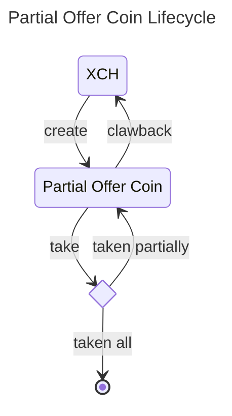

# Partial Offer Coin (PoC)

A dexie partial offer coin is a coin with a puzzle offering one asset (XCH only for now) for another CAT at a fixed exchange rate. A maker can use partial cli to create an offer. The offer can be taken using partial cli and an optional standard Chia offer. The offer can also be clawed back by the maker at any time.

# Design Decisions and Overview
- The partial offer coin is a coin on the blockchain.
- The first partial offer is created by using `partial create` command. When the first offer is created, no new coin is created. The first partial offer coin is created and spent when the offer is taken.
- A file containing partial offer information is a non standard bech32 offer file with partial coin spend. The first partial offer also contains the standard transaction coin spend that creates the first partial offer coin.
- The partial offer can be taken by using `partial take` command.
- When the partial offer is taken partially, the new partial offer coin with the new amount is created.
- The [standard settlement (offer) puzzle](https://chialisp.com/offers/) is utilized to ensure that the assets are exchanged.
- The total amount on the partial offer can be clawed back to the maker by using `partial clawback` command.

# Chialisp

- [partial.clsp](./partial_cli/puzzles/partial.clsp) - The partial offer coin puzzle.
- [fns.clsp](./partial_cli/puzzles/fns.clsp) - The helper functions for the partial offer coin puzzle.

## Parameters
```lisp
  (
        MOD_HASH                ; self puzzle hash 
        FEE_PH                  ; puzzle hash that will receive the fee
        FEE_RATE                ; fee rate (0-10000), e.g., 1% is represented as 100
        MAKER_PH                ; maker puzzle hash (both receive and clawback)
        MAKER_PK                ; maker public key used in clawback case
        TAIL_HASH               ; request CAT tail hash
        RATE                    ; number of CAT per XCH, e.g., 1 XCH = 100 CATs, rate = 100000
        partial_coin_amount     ; amount of partial offer coin
        coin_id                 ; coin id of the partial offer coin
        taken_mojos_or_clawback ; amount of XCH mojos taken, or 0 if clawback
        clawback_fee_mojos      ; blockchain fee in mojos, used in clawback case
  )
```

## Sample
### Create
```bash
❯ partial create -f $partial_fp --offer 1:2 --request d82dd03f8a9ad2f84353cd953c4de6b21dbaaf7de3ba3f4ddd9abe31ecba80ad:600
{
  "partial_info": {
    "fee_puzzle_hash": "bf00456f9fecf7fb57651b0c99ce13bd9d2858e9b190ec373ba158c9a9934e5a",
    "fee_rate": 100,
    "maker_puzzle_hash": "27a3681e800dd064316e74173577be23c9e514ded4b6cd55e4bb84e26a6a55f1",
    "public_key": "8049a7369adf936b3ad73c88fc6abd3d172d1ea1661f7d6597842152c2652966ac6a9b93653124cd93bd9a769a039275",
    "tail_hash": "d82dd03f8a9ad2f84353cd953c4de6b21dbaaf7de3ba3f4ddd9abe31ecba80ad",
    "rate": 300000
  },
  "partial_coin": {
    "parent_coin_info": "0xa5def056fdeace500e7e23d0707eb1750d6774af476174171d216d2520f67886",
    "puzzle_hash": "0x1b5b1e89eb1346736003f23939407387bf66d146c66ae956f6521bc11447680c",
    "amount": 2000000000000
  },
  "launcher_coin": {
    "parent_coin_info": "0x37e381c7936050d9ac639c5832fee8ff37475bc38e64e5971b14cc2ee84bb4d1",
    "puzzle_hash": "0x27a3681e800dd064316e74173577be23c9e514ded4b6cd55e4bb84e26a6a55f1",
    "amount": 1000000000000
  },
  "offer": "offer1qqr83wcuu2rykcmqvpsrvl7u0p78yskqe56ujuez3nltm7r0ac08mwp0uh5hg6v3xdazl09ht329l8pp6lq8kgw9xzh5fh950j0l9jd8ytm6umpmr0axga7t5wk2e5y0gqe4uhze9tqqqma8pmmnjm4scyd3vas8m229wh36uwjh4enm0l5ukpjw6cmmx7s76lmwt2jmn3ndn0zx9s66x2hpsk9dlkha9lh5ee0w8lmqhtq4dsstp5alszhh9eazcllldamn5l8dcverlnql5ycny56s6dklh9s2j4tl6zw2tsgh4rg03lcza95tnnkhcfhv2zwvnukz68v2m0m6wht58wt02vhvtwg0gsg37uxfalmd3st4w73fxpq9f3em63dh0a8h4v9jm9yw8fjml4ju7hmhh32vmc3samex84lal9ta50m8766f2egqwqeckq5g7axxtza77v6xyww7sj9hlklcqhlc49slh5asrhmz6nva9f4cxte3ghkmxwykx2akkm06zcnznhjenlqnukn6aapa3h6huup036559u2dgmfvu4xj7k00nevzyt4tnz464u9d52x4pxsqccxrsnfqc5x2fprx7jzptk2g2kkz3drxsx5d2sdtzhln8wkpags93jvf83qq62whr8mz842ngqy3k3qdppkctsl2962vz30yvg84fdrnsddh7sjg2xx99mfpefhfpvuvu96ny83afqjn9gnwq32jnqhq2qq2566qjnr2sye7luccv0hzj87s4t0d28xyz4p7zqe3jy2atf5w3k4pqewrc5sdmgjga2x7z8y76066sdvqpdv7sqjkkjz6lh8u355qy2zzfscgawgcq39ev83qmj8pqdhu4gtgvnpxwfptggfdjm0vwzm5r42pd4qtv9zhlc2vry3lgkg8erfa073pg02gdyvzct8uruayqrakpglfggcdxu9jyp8tkje5y3n0mgs82x4cf7pzd4dy9mgqpmkrgqrxzgq9nvzvy4kxqhn0k038h34k6dx7xcmny6jza6g433h4q8n884cxcmksemx6t536k4g924m8alaakucnazlwm9e874wc08d8k7ufjh57cj70zem9e88nlnlpl3wte7gu9ydmqyj4qzw6sz2dtyqrzzt2yctfrsckaqv5t0g956ysh3r2gu6ejxd933ks8pqqgrftjgnjpgakpqhvxlnydc7ry3clny3aaqpttpv9zuep52kxhsz6kgvjxhpypz5h65z2rq35gzgrae668pqf2fs69regggvy6grpm2q9vq8ugl9avzu7k25sd25a9w78xd3mwmx7gx6nl88tgkf0lkez5car7tlt0y0meektpq32m087px3lllxl0hlp48frcv70p8hem2c379ew8pphumtqkg6w46wwc9c92xtqy42d4rrgd4nqpk0vhntxmk0ecmt4mknwxn7ktedhzhdes45l9ddf6dd3fqcw5442dtwfng7nn42suhkwf0dnefnrzne2skd8uslhsf7a0tzt87wg8n6wkhchmdjfwmtl4kk8h0k8mm7wmfnlsejhcddg3vnxjmys7s87s3ryzm62dfzkv6nug939zjtxvf8v8jhf0gfemvh656lcemhxmjd38kdh0qm0leqtxuwm302v2tuklln3d8w82gerntt5a6mmahf9lrnzpgfztyhff3dhyjj2euk4a0hqd6pc358mhysahmlfpg6r000ewmkzrxmyj58hhv27c8v5kduhlv73wk6uemu25rsqf6qjyfslg7tju"
}
```
```bash
❯ partial show  ./launcher.offer
╭──────────────────────────┬────────────────────────────────────────────────────────────────────╮
│ MOD_HASH:                │ 0xe506255126ce71dccd6b5dac93d8950ecc863ba5f4aa68b123bfed59beccb03a │
│ Valid:                   │ Yes                                                                │
│ Partial Offer Coin Name: │ 0x27a29bda975974d02edb2d3f9649dd44870edabdb501d05a4c6f22c47a628e87 │
├──────────────────────────┼────────────────────────────────────────────────────────────────────┤
│ Total Offer Amount:      │ 2.0 XCH                                                            │
│ Total Request Amount:    │ 600.0 CATs                                                         │
│ Request Tail Hash:       │ 0xd82dd03f8a9ad2f84353cd953c4de6b21dbaaf7de3ba3f4ddd9abe31ecba80ad │
│ Rate (1 XCH):            │ 300.0 CATs                                                         │
│ Fee Rate:                │ 1.0%                                                               │
╰──────────────────────────┴────────────────────────────────────────────────────────────────────╯
```

#### Curried Parameters
```lisp
(
  ; MOD_HASH 
  0xe506255126ce71dccd6b5dac93d8950ecc863ba5f4aa68b123bfed59beccb03a
  ; FEE_PH 
  0xbf00456f9fecf7fb57651b0c99ce13bd9d2858e9b190ec373ba158c9a9934e5a
  ; FEE_RATE   
  100                                                               
  ; MAKER_PH 
  0x27a3681e800dd064316e74173577be23c9e514ded4b6cd55e4bb84e26a6a55f1
  ; MAKER_PK
  0x8049a7369adf936b3ad73c88fc6abd3d172d1ea1661f7d6597842152c2652966ac6a9b93653124cd93bd9a769a039275   
  ; TAIL_HASH (TDBX) 
  0xd82dd03f8a9ad2f84353cd953c4de6b21dbaaf7de3ba3f4ddd9abe31ecba80ad
  ; RATE (1XCH -> 300 CAT, 300000)
  0x0493e0
) 
```

### Taken 
```bash
❯ partial take -f $partial_taker_fp -a $(1e12) -m 1 ./launcher.offer
╭──────────────────────────┬────────────────────────────────────────────────────────────────────╮
│ MOD_HASH:                │ 0xe506255126ce71dccd6b5dac93d8950ecc863ba5f4aa68b123bfed59beccb03a │
│ Valid:                   │ Yes                                                                │
│ Partial Offer Coin Name: │ 0x27a29bda975974d02edb2d3f9649dd44870edabdb501d05a4c6f22c47a628e87 │
├──────────────────────────┼────────────────────────────────────────────────────────────────────┤
│ Total Offer Amount:      │ 2.0 XCH                                                            │
│ Total Request Amount:    │ 600.0 CATs                                                         │
│ Request Tail Hash:       │ 0xd82dd03f8a9ad2f84353cd953c4de6b21dbaaf7de3ba3f4ddd9abe31ecba80ad │
│ Rate (1 XCH):            │ 300.0 CATs                                                         │
│ Fee Rate:                │ 1.0%                                                               │
╰──────────────────────────┴────────────────────────────────────────────────────────────────────╯

 300.0 CATs -> 1.0 XCH
 Sending 300.0 CATs
 Paying 0.01 XCH in fees
 Receiving 0.99 XCH
```

#### Full Spend Bundle
```json
{
  "coin_spends": [
    {
      "coin": {
        "parent_coin_info": "0x37e381c7936050d9ac639c5832fee8ff37475bc38e64e5971b14cc2ee84bb4d1",
        "puzzle_hash": "0x27a3681e800dd064316e74173577be23c9e514ded4b6cd55e4bb84e26a6a55f1",
        "amount": 1000000000000
      },
      "puzzle_reveal": "0xff02ffff01ff02ffff01ff02ffff03ff0bffff01ff02ffff03ffff09ff05ffff1dff0bffff1effff0bff0bffff02ff06ffff04ff02ffff04ff17ff8080808080808080ffff01ff02ff17ff2f80ffff01ff088080ff0180ffff01ff04ffff04ff04ffff04ff05ffff04ffff02ff06ffff04ff02ffff04ff17ff80808080ff80808080ffff02ff17ff2f808080ff0180ffff04ffff01ff32ff02ffff03ffff07ff0580ffff01ff0bffff0102ffff02ff06ffff04ff02ffff04ff09ff80808080ffff02ff06ffff04ff02ffff04ff0dff8080808080ffff01ff0bffff0101ff058080ff0180ff018080ffff04ffff01b0a18b513c7779d2cc4a25ccf78f75e9800905ec9a8ce37d8e6d2738cb04b3ac1665687a60e8244eadbfe9dc950b8fc6faff018080",
      "solution": "0xff80ffff01ffff3cffa00e79b9a2e3febf8f0b6599bc9857e0afc891192930b3dcd0392a7fc13704804d80ffff33ffa01b5b1e89eb1346736003f23939407387bf66d146c66ae956f6521bc11447680cff8601d1a94a200080ffff33ffa05f407f3b888f8f2712a11b5aca3fad3725fbef21690dc440ee92e7ef8a6bd87dff85746a5288008080ff8080"
    },
    {
      "coin": {
        "parent_coin_info": "0x37e381c7936050d9ac639c5832fee8ff37475bc38e64e5971b14cc2ee84bb4d1",
        "puzzle_hash": "0x27a3681e800dd064316e74173577be23c9e514ded4b6cd55e4bb84e26a6a55f1",
        "amount": 1500000000000
      },
      "puzzle_reveal": "0xff02ffff01ff02ffff01ff02ffff03ff0bffff01ff02ffff03ffff09ff05ffff1dff0bffff1effff0bff0bffff02ff06ffff04ff02ffff04ff17ff8080808080808080ffff01ff02ff17ff2f80ffff01ff088080ff0180ffff01ff04ffff04ff04ffff04ff05ffff04ffff02ff06ffff04ff02ffff04ff17ff80808080ff80808080ffff02ff17ff2f808080ff0180ffff04ffff01ff32ff02ffff03ffff07ff0580ffff01ff0bffff0102ffff02ff06ffff04ff02ffff04ff09ff80808080ffff02ff06ffff04ff02ffff04ff0dff8080808080ffff01ff0bffff0101ff058080ff0180ff018080ffff04ffff01b0a18b513c7779d2cc4a25ccf78f75e9800905ec9a8ce37d8e6d2738cb04b3ac1665687a60e8244eadbfe9dc950b8fc6faff018080",
      "solution": "0xff80ffff01ffff3dffa00f13e53187e556b83f84828924ad53d2025abe38c6649b8aad67b4021a0d9af38080ff8080"
    },
    {
      "coin": {
        "parent_coin_info": "0xa5def056fdeace500e7e23d0707eb1750d6774af476174171d216d2520f67886",
        "puzzle_hash": "0x1b5b1e89eb1346736003f23939407387bf66d146c66ae956f6521bc11447680c",
        "amount": 2000000000000
      },
      "puzzle_reveal": "0xff02ffff01ff02ffff01ff04ffff04ffff0149ffff04ff8202ffff808080ffff02ffff03ffff15ff820bffff8080ffff01ff02ff2cffff04ff02ffff04ffff04ffff04ffff0146ffff04ff8205ffff808080ffff04ffff02ff1affff04ff02ffff04ff2fffff04ff8200bfffff04ff8205ffffff04ffff02ff3cffff04ff02ffff04ff82017fffff04ff820bffff8080808080ff80808080808080ffff04ffff02ff16ffff04ff02ffff04ffff11ff820bffffff02ff12ffff04ff02ffff04ff17ffff04ff820bffff808080808080ff80808080ffff04ffff04ffff0133ffff04ff0bffff04ffff02ff12ffff04ff02ffff04ff17ffff04ff820bffff8080808080ff80808080ff8080808080ffff04ffff02ffff03ffff15ffff11ff8202ffff820bff80ff8080ffff01ff04ffff02ff2effff04ff02ffff04ff05ffff04ff0bffff04ff17ffff04ff2fffff04ff5fffff04ff8200bfffff04ff82017fffff04ffff11ff8202ffff820bff80ff8080808080808080808080ff8080ffff01ff018080ff0180ff8080808080ffff01ff02ff3effff04ff02ffff04ff2fffff04ff5fffff04ff8202ffffff04ff8217ffff8080808080808080ff018080ffff04ffff01ffffffff02ffff03ff05ffff01ff02ff10ffff04ff02ffff04ff0dffff04ffff0bffff0102ffff0bffff0101ffff010480ffff0bffff0102ffff0bffff0102ffff0bffff0101ffff010180ff0980ffff0bffff0102ff0bffff0bffff0101ff8080808080ff8080808080ffff010b80ff0180ff0bffff0102ffff0bffff0101ffff010280ffff0bffff0102ffff0bffff0102ffff0bffff0101ffff010180ff0580ffff0bffff0102ffff02ff10ffff04ff02ffff04ff07ffff04ffff0bffff0101ffff010180ff8080808080ffff0bffff0101ff8080808080ffff02ffff03ffff07ff0580ffff01ff0bffff0102ffff02ff14ffff04ff02ffff04ff09ff80808080ffff02ff14ffff04ff02ffff04ff0dff8080808080ffff01ff0bffff0101ff058080ff0180ffff02ffff03ff0bffff01ff02ff2cffff04ff02ffff04ffff02ffff03ff13ffff01ff04ff13ff0580ffff010580ff0180ffff04ff1bff8080808080ffff010580ff0180ff05ffff14ffff12ff05ff0b80ffff018600e8d4a510008080ffffff05ffff14ffff12ff05ff0b80ffff018227108080ff04ffff013fffff04ffff0bffff02ff18ffff04ff02ffff04ffff01a037bef360ee858133b69d595a906dc45d01af50379dad515eb9518abb7c1d2a7affff04ffff01a0cfbfdeed5c4ca2de3d0bf520b9cb4bb7743a359bd2e6a188d19ce7dffc21d3e7ffff04ffff0bffff0101ff0b80ffff04ffff0bffff0101ffff01a037bef360ee858133b69d595a906dc45d01af50379dad515eb9518abb7c1d2a7a80ff80808080808080ffff02ff14ffff04ff02ffff04ffff04ff17ffff04ffff04ff05ffff04ff2fffff04ffff04ff05ff8080ff80808080ff808080ff8080808080ff808080ffff04ffff0133ffff04ffff01a0cfbfdeed5c4ca2de3d0bf520b9cb4bb7743a359bd2e6a188d19ce7dffc21d3e7ffff04ff05ff80808080ffff04ffff0133ffff04ffff02ff18ffff04ff02ffff04ff05ffff04ffff0bffff0101ff82017f80ffff04ffff0bffff0101ff8200bf80ffff04ffff0bffff0101ff5f80ffff04ffff0bffff0101ff2f80ffff04ffff0bffff0101ff1780ffff04ffff0bffff0101ff0b80ffff04ffff0bffff0101ff0580ff8080808080808080808080ffff04ff8202ffff80808080ff02ff2cffff04ff02ffff04ffff04ffff04ffff0133ffff04ff05ffff04ffff11ff17ff2f80ff80808080ffff04ffff04ffff0132ffff04ff0bffff04ffff0bff1780ff80808080ff808080ffff04ffff04ffff02ffff03ffff15ff2fff8080ffff01ff04ffff0134ffff04ff2fff808080ffff01ff018080ff0180ff8080ff8080808080ff018080ffff04ffff01a0e506255126ce71dccd6b5dac93d8950ecc863ba5f4aa68b123bfed59beccb03affff04ffff01a0bf00456f9fecf7fb57651b0c99ce13bd9d2858e9b190ec373ba158c9a9934e5affff04ffff0164ffff04ffff01a027a3681e800dd064316e74173577be23c9e514ded4b6cd55e4bb84e26a6a55f1ffff04ffff01b08049a7369adf936b3ad73c88fc6abd3d172d1ea1661f7d6597842152c2652966ac6a9b93653124cd93bd9a769a039275ffff04ffff01a0d82dd03f8a9ad2f84353cd953c4de6b21dbaaf7de3ba3f4ddd9abe31ecba80adffff04ffff01830493e0ff018080808080808080",
      "solution": "0xff8601d1a94a2000ffa027a29bda975974d02edb2d3f9649dd44870edabdb501d05a4c6f22c47a628e87ff8600e8d4a51000ff8080"
    },
    {
      "coin": {
        "parent_coin_info": "0x27a29bda975974d02edb2d3f9649dd44870edabdb501d05a4c6f22c47a628e87",
        "puzzle_hash": "0xcfbfdeed5c4ca2de3d0bf520b9cb4bb7743a359bd2e6a188d19ce7dffc21d3e7",
        "amount": 990000000000
      },
      "puzzle_reveal": "0xff02ffff01ff02ff0affff04ff02ffff04ff03ff80808080ffff04ffff01ffff333effff02ffff03ff05ffff01ff04ffff04ff0cffff04ffff02ff1effff04ff02ffff04ff09ff80808080ff808080ffff02ff16ffff04ff02ffff04ff19ffff04ffff02ff0affff04ff02ffff04ff0dff80808080ff808080808080ff8080ff0180ffff02ffff03ff05ffff01ff02ffff03ffff15ff29ff8080ffff01ff04ffff04ff08ff0980ffff02ff16ffff04ff02ffff04ff0dffff04ff0bff808080808080ffff01ff088080ff0180ffff010b80ff0180ff02ffff03ffff07ff0580ffff01ff0bffff0102ffff02ff1effff04ff02ffff04ff09ff80808080ffff02ff1effff04ff02ffff04ff0dff8080808080ffff01ff0bffff0101ff058080ff0180ff018080",
      "solution": "0xffffa00029b77b7b232924e92df7afd41b34995ea77f6a082a457a721206cad2b9448bffffa0576be3af2f4cb87ea9cb281c8525411ce24aede112c6123f20bc4f075047f013ff8600e680992c00ff80808080"
    },
    {
      "coin": {
        "parent_coin_info": "0xffb149caf4832758484759b744948635980156d5a6f0c592a3d106da6b715cb6",
        "puzzle_hash": "0x9990b8d8847911f83a8d107071b6e18e18b7ddab8a8ddee5a26e0cf7c89e3457",
        "amount": 300000
      },
      "puzzle_reveal": "0xff02ffff01ff02ffff01ff02ff5effff04ff02ffff04ffff04ff05ffff04ffff0bff34ff0580ffff04ff0bff80808080ffff04ffff02ff17ff2f80ffff04ff5fffff04ffff02ff2effff04ff02ffff04ff17ff80808080ffff04ffff02ff2affff04ff02ffff04ff82027fffff04ff82057fffff04ff820b7fff808080808080ffff04ff81bfffff04ff82017fffff04ff8202ffffff04ff8205ffffff04ff820bffff80808080808080808080808080ffff04ffff01ffffffff3d46ff02ff333cffff0401ff01ff81cb02ffffff20ff02ffff03ff05ffff01ff02ff32ffff04ff02ffff04ff0dffff04ffff0bff7cffff0bff34ff2480ffff0bff7cffff0bff7cffff0bff34ff2c80ff0980ffff0bff7cff0bffff0bff34ff8080808080ff8080808080ffff010b80ff0180ffff02ffff03ffff22ffff09ffff0dff0580ff2280ffff09ffff0dff0b80ff2280ffff15ff17ffff0181ff8080ffff01ff0bff05ff0bff1780ffff01ff088080ff0180ffff02ffff03ff0bffff01ff02ffff03ffff09ffff02ff2effff04ff02ffff04ff13ff80808080ff820b9f80ffff01ff02ff56ffff04ff02ffff04ffff02ff13ffff04ff5fffff04ff17ffff04ff2fffff04ff81bfffff04ff82017fffff04ff1bff8080808080808080ffff04ff82017fff8080808080ffff01ff088080ff0180ffff01ff02ffff03ff17ffff01ff02ffff03ffff20ff81bf80ffff0182017fffff01ff088080ff0180ffff01ff088080ff018080ff0180ff04ffff04ff05ff2780ffff04ffff10ff0bff5780ff778080ffffff02ffff03ff05ffff01ff02ffff03ffff09ffff02ffff03ffff09ff11ff5880ffff0159ff8080ff0180ffff01818f80ffff01ff02ff26ffff04ff02ffff04ff0dffff04ff0bffff04ffff04ff81b9ff82017980ff808080808080ffff01ff02ff7affff04ff02ffff04ffff02ffff03ffff09ff11ff5880ffff01ff04ff58ffff04ffff02ff76ffff04ff02ffff04ff13ffff04ff29ffff04ffff0bff34ff5b80ffff04ff2bff80808080808080ff398080ffff01ff02ffff03ffff09ff11ff7880ffff01ff02ffff03ffff20ffff02ffff03ffff09ffff0121ffff0dff298080ffff01ff02ffff03ffff09ffff0cff29ff80ff3480ff5c80ffff01ff0101ff8080ff0180ff8080ff018080ffff0109ffff01ff088080ff0180ffff010980ff018080ff0180ffff04ffff02ffff03ffff09ff11ff5880ffff0159ff8080ff0180ffff04ffff02ff26ffff04ff02ffff04ff0dffff04ff0bffff04ff17ff808080808080ff80808080808080ff0180ffff01ff04ff80ffff04ff80ff17808080ff0180ffff02ffff03ff05ffff01ff04ff09ffff02ff56ffff04ff02ffff04ff0dffff04ff0bff808080808080ffff010b80ff0180ff0bff7cffff0bff34ff2880ffff0bff7cffff0bff7cffff0bff34ff2c80ff0580ffff0bff7cffff02ff32ffff04ff02ffff04ff07ffff04ffff0bff34ff3480ff8080808080ffff0bff34ff8080808080ffff02ffff03ffff07ff0580ffff01ff0bffff0102ffff02ff2effff04ff02ffff04ff09ff80808080ffff02ff2effff04ff02ffff04ff0dff8080808080ffff01ff0bffff0101ff058080ff0180ffff04ffff04ff30ffff04ff5fff808080ffff02ff7effff04ff02ffff04ffff04ffff04ff2fff0580ffff04ff5fff82017f8080ffff04ffff02ff26ffff04ff02ffff04ff0bffff04ff05ffff01ff808080808080ffff04ff17ffff04ff81bfffff04ff82017fffff04ffff02ff2affff04ff02ffff04ff8204ffffff04ffff02ff76ffff04ff02ffff04ff09ffff04ff820affffff04ffff0bff34ff2d80ffff04ff15ff80808080808080ffff04ff8216ffff808080808080ffff04ff8205ffffff04ff820bffff808080808080808080808080ff02ff5affff04ff02ffff04ff5fffff04ff3bffff04ffff02ffff03ff17ffff01ff09ff2dffff02ff2affff04ff02ffff04ff27ffff04ffff02ff76ffff04ff02ffff04ff29ffff04ff57ffff04ffff0bff34ff81b980ffff04ff59ff80808080808080ffff04ff81b7ff80808080808080ff8080ff0180ffff04ff17ffff04ff05ffff04ff8202ffffff04ffff04ffff04ff78ffff04ffff0eff5cffff02ff2effff04ff02ffff04ffff04ff2fffff04ff82017fff808080ff8080808080ff808080ffff04ffff04ff20ffff04ffff0bff81bfff5cffff02ff2effff04ff02ffff04ffff04ff15ffff04ffff10ff82017fffff11ff8202dfff2b80ff8202ff80ff808080ff8080808080ff808080ff138080ff80808080808080808080ff018080ffff04ffff01a037bef360ee858133b69d595a906dc45d01af50379dad515eb9518abb7c1d2a7affff04ffff01a0d82dd03f8a9ad2f84353cd953c4de6b21dbaaf7de3ba3f4ddd9abe31ecba80adffff04ffff01ff02ffff01ff02ffff01ff02ffff03ff0bffff01ff02ffff03ffff09ff05ffff1dff0bffff1effff0bff0bffff02ff06ffff04ff02ffff04ff17ff8080808080808080ffff01ff02ff17ff2f80ffff01ff088080ff0180ffff01ff04ffff04ff04ffff04ff05ffff04ffff02ff06ffff04ff02ffff04ff17ff80808080ff80808080ffff02ff17ff2f808080ff0180ffff04ffff01ff32ff02ffff03ffff07ff0580ffff01ff0bffff0102ffff02ff06ffff04ff02ffff04ff09ff80808080ffff02ff06ffff04ff02ffff04ff0dff8080808080ffff01ff0bffff0101ff058080ff0180ff018080ffff04ffff01b08ed1c6ea3debbc56b104369d60f0557c9135fc09b654b95848d9f7625e8c939832f8196cf3039493b102e65df9be3d65ff018080ff0180808080",
      "solution": "0xffff80ffff01ffff3fffa05f1a2ebaeb121205ed7561d6a7c6b6b4a2e139d8faf91b83a539bc132f4b1cb880ffff3cffa001cc9fa53a5259d8070254552e9e4fa4ad091b6e1db78f927425d7393d4b651480ffff33ffa0cfbfdeed5c4ca2de3d0bf520b9cb4bb7743a359bd2e6a188d19ce7dffc21d3e7ff830493e0ffffa0cfbfdeed5c4ca2de3d0bf520b9cb4bb7743a359bd2e6a188d19ce7dffc21d3e7808080ff8080ffffa0f198da64f4e6472d491d481c8b2db6e2d0e6cbf196210cf825669c11c21a4bf0ffa0808e33c7fcef761b1c9156e9383336b505c03d028895d866c3c24e7ca81c99e8ff830b371880ffa084150482d59dca4388355de61f3101b653f7db9f6304f463ca4b489244c6633affffa0ffb149caf4832758484759b744948635980156d5a6f0c592a3d106da6b715cb6ffa09990b8d8847911f83a8d107071b6e18e18b7ddab8a8ddee5a26e0cf7c89e3457ff830493e080ffffa0ffb149caf4832758484759b744948635980156d5a6f0c592a3d106da6b715cb6ffa0808e33c7fcef761b1c9156e9383336b505c03d028895d866c3c24e7ca81c99e8ff830493e080ff80ff8080"
    },
    {
      "coin": {
        "parent_coin_info": "0x177b19e79abdd1a1b1a695ca724906540fc2d4cb8c25e75b78fbe952a5d115fc",
        "puzzle_hash": "0x808e33c7fcef761b1c9156e9383336b505c03d028895d866c3c24e7ca81c99e8",
        "amount": 123499950000
      },
      "puzzle_reveal": "0xff02ffff01ff02ffff01ff02ffff03ff0bffff01ff02ffff03ffff09ff05ffff1dff0bffff1effff0bff0bffff02ff06ffff04ff02ffff04ff17ff8080808080808080ffff01ff02ff17ff2f80ffff01ff088080ff0180ffff01ff04ffff04ff04ffff04ff05ffff04ffff02ff06ffff04ff02ffff04ff17ff80808080ff80808080ffff02ff17ff2f808080ff0180ffff04ffff01ff32ff02ffff03ffff07ff0580ffff01ff0bffff0102ffff02ff06ffff04ff02ffff04ff09ff80808080ffff02ff06ffff04ff02ffff04ff0dff8080808080ffff01ff0bffff0101ff058080ff0180ff018080ffff04ffff01b08ed1c6ea3debbc56b104369d60f0557c9135fc09b654b95848d9f7625e8c939832f8196cf3039493b102e65df9be3d65ff018080",
      "solution": "0xff80ffff01ffff3dffa0060e8721e609beea4287995715e839ed3ae48e67b178d615414577e857fcc3f480ffff3cffa003542b3283104379a6fac1e0255dd23169f77f2c8337a22da787911ba07ad96980ffff33ffa0576be3af2f4cb87ea9cb281c8525411ce24aede112c6123f20bc4f075047f013ff851cc12bafaf80ffff34ff018080ff8080"
    },
    {
      "coin": {
        "parent_coin_info": "0x84150482d59dca4388355de61f3101b653f7db9f6304f463ca4b489244c6633a",
        "puzzle_hash": "0x97e06ce07905686dbce24559b9691fdcbadf400da9cc7675c35d8beb87301974",
        "amount": 300000
      },
      "puzzle_reveal": "0xff02ffff01ff02ffff01ff02ff5effff04ff02ffff04ffff04ff05ffff04ffff0bff34ff0580ffff04ff0bff80808080ffff04ffff02ff17ff2f80ffff04ff5fffff04ffff02ff2effff04ff02ffff04ff17ff80808080ffff04ffff02ff2affff04ff02ffff04ff82027fffff04ff82057fffff04ff820b7fff808080808080ffff04ff81bfffff04ff82017fffff04ff8202ffffff04ff8205ffffff04ff820bffff80808080808080808080808080ffff04ffff01ffffffff3d46ff02ff333cffff0401ff01ff81cb02ffffff20ff02ffff03ff05ffff01ff02ff32ffff04ff02ffff04ff0dffff04ffff0bff7cffff0bff34ff2480ffff0bff7cffff0bff7cffff0bff34ff2c80ff0980ffff0bff7cff0bffff0bff34ff8080808080ff8080808080ffff010b80ff0180ffff02ffff03ffff22ffff09ffff0dff0580ff2280ffff09ffff0dff0b80ff2280ffff15ff17ffff0181ff8080ffff01ff0bff05ff0bff1780ffff01ff088080ff0180ffff02ffff03ff0bffff01ff02ffff03ffff09ffff02ff2effff04ff02ffff04ff13ff80808080ff820b9f80ffff01ff02ff56ffff04ff02ffff04ffff02ff13ffff04ff5fffff04ff17ffff04ff2fffff04ff81bfffff04ff82017fffff04ff1bff8080808080808080ffff04ff82017fff8080808080ffff01ff088080ff0180ffff01ff02ffff03ff17ffff01ff02ffff03ffff20ff81bf80ffff0182017fffff01ff088080ff0180ffff01ff088080ff018080ff0180ff04ffff04ff05ff2780ffff04ffff10ff0bff5780ff778080ffffff02ffff03ff05ffff01ff02ffff03ffff09ffff02ffff03ffff09ff11ff5880ffff0159ff8080ff0180ffff01818f80ffff01ff02ff26ffff04ff02ffff04ff0dffff04ff0bffff04ffff04ff81b9ff82017980ff808080808080ffff01ff02ff7affff04ff02ffff04ffff02ffff03ffff09ff11ff5880ffff01ff04ff58ffff04ffff02ff76ffff04ff02ffff04ff13ffff04ff29ffff04ffff0bff34ff5b80ffff04ff2bff80808080808080ff398080ffff01ff02ffff03ffff09ff11ff7880ffff01ff02ffff03ffff20ffff02ffff03ffff09ffff0121ffff0dff298080ffff01ff02ffff03ffff09ffff0cff29ff80ff3480ff5c80ffff01ff0101ff8080ff0180ff8080ff018080ffff0109ffff01ff088080ff0180ffff010980ff018080ff0180ffff04ffff02ffff03ffff09ff11ff5880ffff0159ff8080ff0180ffff04ffff02ff26ffff04ff02ffff04ff0dffff04ff0bffff04ff17ff808080808080ff80808080808080ff0180ffff01ff04ff80ffff04ff80ff17808080ff0180ffff02ffff03ff05ffff01ff04ff09ffff02ff56ffff04ff02ffff04ff0dffff04ff0bff808080808080ffff010b80ff0180ff0bff7cffff0bff34ff2880ffff0bff7cffff0bff7cffff0bff34ff2c80ff0580ffff0bff7cffff02ff32ffff04ff02ffff04ff07ffff04ffff0bff34ff3480ff8080808080ffff0bff34ff8080808080ffff02ffff03ffff07ff0580ffff01ff0bffff0102ffff02ff2effff04ff02ffff04ff09ff80808080ffff02ff2effff04ff02ffff04ff0dff8080808080ffff01ff0bffff0101ff058080ff0180ffff04ffff04ff30ffff04ff5fff808080ffff02ff7effff04ff02ffff04ffff04ffff04ff2fff0580ffff04ff5fff82017f8080ffff04ffff02ff26ffff04ff02ffff04ff0bffff04ff05ffff01ff808080808080ffff04ff17ffff04ff81bfffff04ff82017fffff04ffff02ff2affff04ff02ffff04ff8204ffffff04ffff02ff76ffff04ff02ffff04ff09ffff04ff820affffff04ffff0bff34ff2d80ffff04ff15ff80808080808080ffff04ff8216ffff808080808080ffff04ff8205ffffff04ff820bffff808080808080808080808080ff02ff5affff04ff02ffff04ff5fffff04ff3bffff04ffff02ffff03ff17ffff01ff09ff2dffff02ff2affff04ff02ffff04ff27ffff04ffff02ff76ffff04ff02ffff04ff29ffff04ff57ffff04ffff0bff34ff81b980ffff04ff59ff80808080808080ffff04ff81b7ff80808080808080ff8080ff0180ffff04ff17ffff04ff05ffff04ff8202ffffff04ffff04ffff04ff78ffff04ffff0eff5cffff02ff2effff04ff02ffff04ffff04ff2fffff04ff82017fff808080ff8080808080ff808080ffff04ffff04ff20ffff04ffff0bff81bfff5cffff02ff2effff04ff02ffff04ffff04ff15ffff04ffff10ff82017fffff11ff8202dfff2b80ff8202ff80ff808080ff8080808080ff808080ff138080ff80808080808080808080ff018080ffff04ffff01a037bef360ee858133b69d595a906dc45d01af50379dad515eb9518abb7c1d2a7affff04ffff01a0d82dd03f8a9ad2f84353cd953c4de6b21dbaaf7de3ba3f4ddd9abe31ecba80adffff04ffff01ff02ffff01ff02ff0affff04ff02ffff04ff03ff80808080ffff04ffff01ffff333effff02ffff03ff05ffff01ff04ffff04ff0cffff04ffff02ff1effff04ff02ffff04ff09ff80808080ff808080ffff02ff16ffff04ff02ffff04ff19ffff04ffff02ff0affff04ff02ffff04ff0dff80808080ff808080808080ff8080ff0180ffff02ffff03ff05ffff01ff02ffff03ffff15ff29ff8080ffff01ff04ffff04ff08ff0980ffff02ff16ffff04ff02ffff04ff0dffff04ff0bff808080808080ffff01ff088080ff0180ffff010b80ff0180ff02ffff03ffff07ff0580ffff01ff0bffff0102ffff02ff1effff04ff02ffff04ff09ff80808080ffff02ff1effff04ff02ffff04ff0dff8080808080ffff01ff0bffff0101ff058080ff0180ff018080ff0180808080",
      "solution": "0xffffffa027a29bda975974d02edb2d3f9649dd44870edabdb501d05a4c6f22c47a628e87ffffa027a3681e800dd064316e74173577be23c9e514ded4b6cd55e4bb84e26a6a55f1ff830493e0ffffa027a3681e800dd064316e74173577be23c9e514ded4b6cd55e4bb84e26a6a55f180808080ffffa0ffb149caf4832758484759b744948635980156d5a6f0c592a3d106da6b715cb6ffa0808e33c7fcef761b1c9156e9383336b505c03d028895d866c3c24e7ca81c99e8ff830493e080ffa087253fd18293c731b2cac1c82ae02c93256177a9398760f98d1bbf2136ec81a5ffffa084150482d59dca4388355de61f3101b653f7db9f6304f463ca4b489244c6633affa097e06ce07905686dbce24559b9691fdcbadf400da9cc7675c35d8beb87301974ff830493e080ffffa084150482d59dca4388355de61f3101b653f7db9f6304f463ca4b489244c6633affa0cfbfdeed5c4ca2de3d0bf520b9cb4bb7743a359bd2e6a188d19ce7dffc21d3e7ff830493e080ff80ff8080"
    }
  ],
  "aggregated_signature": "0xb557ae716ee98dd7778e7e6cb294eeb9fe3afdd886baaa79d3f1b26a4919eb590b693ffe012bc809f63594e2499820f704e827ff73033111c9fe4266e2f42f42f2b4700b3543747d73d34bac53ad327c0e1bf3f9066e7911524f6b55888c0fb9"
}
```
##### Partial Coin
```json
{
  "parent_coin_info": "0xa5def056fdeace500e7e23d0707eb1750d6774af476174171d216d2520f67886",
  "puzzle_hash": "0x1b5b1e89eb1346736003f23939407387bf66d146c66ae956f6521bc11447680c",
  "amount": 2000000000000
}
```
#### Parameters
```lisp
(
  ; partial_coin_amount (2 XCH)
  0x01d1a94a2000 
  ; coin_id
  0x27a29bda975974d02edb2d3f9649dd44870edabdb501d05a4c6f22c47a628e87
  ; taken_mojos_or_clawback (1 XCH)
  0x00e8d4a51000
  ; clawback_fee_mojos (zero for taken case)
  ()
)              


```
#### Conditions
```lisp
(ASSERT_MY_AMOUNT  0x01d1a94a2000)
; create a new partial offer coin (1 XCH)
(CREATE_COIN  0x1b5b1e89eb1346736003f23939407387bf66d146c66ae956f6521bc11447680c 0x00e8d4a51000)
(ASSERT_MY_COIN_ID  0x27a29bda975974d02edb2d3f9649dd44870edabdb501d05a4c6f22c47a628e87)
; assert announcement from taker settlement coin
(ASSERT_PUZZLE_ANNOUNCEMENT  0xe6a193a62e190063b42335eadc6f7f0286e01282e2c8b6a9417d2d8787556a97)
; create an ephemeral XCH settlement coin (pay to taker 0.99 XCH)
(CREATE_COIN  0xcfbfdeed5c4ca2de3d0bf520b9cb4bb7743a359bd2e6a188d19ce7dffc21d3e7 0x00e680992c00)
; create a fee coin (0.01 XCH)
(CREATE_COIN  0xbf00456f9fecf7fb57651b0c99ce13bd9d2858e9b190ec373ba158c9a9934e5a 0x02540be400) 
```


### Clawback 
#### conditions
```lisp
```

#### Taken
```lisp
```



# Partial CLI commands
```bash
❯ partial --help

 Usage: partial [OPTIONS] COMMAND [ARGS]...

 Manage dexie partial offers

╭─ Options ─────────────────────────────────────────────────────────────────────────────────────────╮
│ --help      Show this message and exit.                                                           │
╰───────────────────────────────────────────────────────────────────────────────────────────────────╯
╭─ Commands ────────────────────────────────────────────────────────────────────────────────────────╮
│ clawback   clawback the partial offer coin.                                                       │
│ config     display the cli config                                                                 │
│ create     create a partial offer requesting CAT token                                            │
│ get        get a serialized curried puzzle of the partial offer coin                              │
│ show       display the dexie partial offer information.                                           │
│ take       Take the dexie partial offer by providing the taker offer file or request information. │
╰───────────────────────────────────────────────────────────────────────────────────────────────────╯

```
