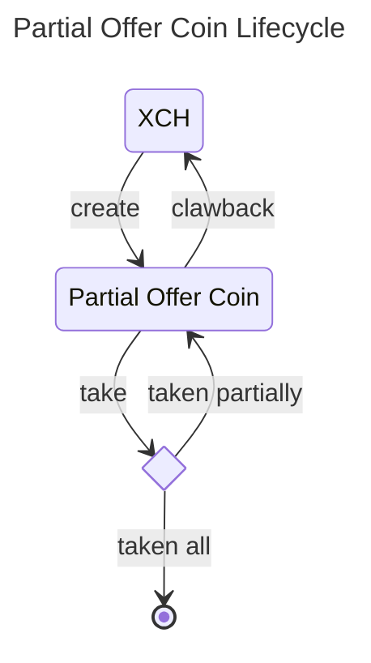

# Partial Offer Coin (PoC)

A dexie partial offer coin is a coin with a puzzle offering one asset (XCH only for now) for another CAT at a fixed exchange rate. A maker can use partial cli to create an offer. The offer can be taken using partial cli and an optional standard Chia offer. The offer can also be clawed back by the maker at any time.

# Design Decisions and Overview
- The partial offer coin is a coin on the blockchain.
- The first partial offer is created by using `partial create` command. When the first offer is created, no new coin is created. The first partial offer coin is created and spent when the offer is taken.
- A file containing partial offer information is a non standard bech32 offer file with partial coin spend. The first partial offer also contains the standard transaction coin spend that creates the first partial offer coin.
- The partial offer can be taken by using `partial take` command.
- When the partial offer is taken partially, the new partial offer coin with the new amount is created.
- The [standard settlement (offer) puzzle](https://chialisp.com/offers/) is utilized to ensure that the assets are exchanged.
- The total amount on the partial offer can be clawed back to the maker by using `partial clawback` command.

# Chialisp

- [partial.clsp](./partial_cli/puzzles/partial.clsp) - The partial offer coin puzzle.
- [fns.clsp](./partial_cli/puzzles/fns.clsp) - The helper functions for the partial offer coin puzzle.

## Parameters
```lisp
  (
        MOD_HASH                ; self puzzle hash 
        FEE_PH                  ; puzzle hash that will receive the fee
        FEE_RATE                ; fee rate (0-10000), e.g., 1% is represented as 100
        MAKER_PH                ; maker puzzle hash (both receive and clawback)
        MAKER_PK                ; maker public key used in clawback case
        TAIL_HASH               ; request CAT tail hash
        RATE                    ; number of CAT per XCH, e.g., 1 XCH = 100 CATs, rate = 100
        partial_coin_amount     ; amount of partial offer coin
        coin_id                 ; coin id of the partial offer coin
        taken_mojos_or_clawback ; amount of XCH mojos taken, or 0 if clawback
        clawback_fee_mojos      ; blockchain fee in mojos, used in clawback case
  )
```
## Sample taken conditions
```lisp
```

## Sample clawback conditions
```lisp
```

## 


# Partial CLI commands
```bash
❯ partial --help

 Usage: partial [OPTIONS] COMMAND [ARGS]...

 Manage dexie partial offers

╭─ Options ─────────────────────────────────────────────────────────────────────────────────────────╮
│ --help      Show this message and exit.                                                           │
╰───────────────────────────────────────────────────────────────────────────────────────────────────╯
╭─ Commands ────────────────────────────────────────────────────────────────────────────────────────╮
│ clawback   clawback the partial offer coin.                                                       │
│ config     display the cli config                                                                 │
│ create     create a partial offer requesting CAT token                                            │
│ get        get a serialized curried puzzle of the partial offer coin                              │
│ show       display the dexie partial offer information.                                           │
│ take       Take the dexie partial offer by providing the taker offer file or request information. │
╰───────────────────────────────────────────────────────────────────────────────────────────────────╯

```
