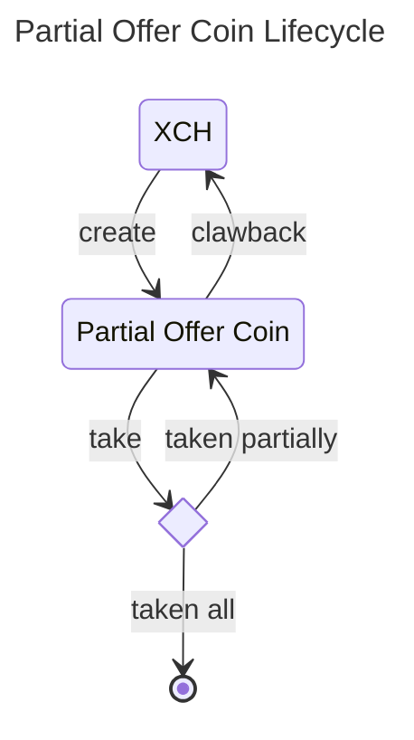

# Partial Offer Coin (PoC)

A dexie partial offer coin is a coin with a puzzle offering one asset (XCH or CAT) for another assert at a fixed exchange rate. A maker can use partial cli to create an offer. The offer can be taken using partial cli with an optional standard Chia offer. The offer can also be clawed back by the maker at any time.

# Design Decisions and Overview
- The partial offer coin is a coin on the blockchain.
- The first partial offer is created by using `partial create` command. When the first offer is created, no new coin is created, but the launcher coin (i.e., the coin creating the first partial offer coin) is locked. When the partial offer is taken, the launcher coin, the first partial offer coin is created, and spent.
- A file containing partial offer information is a non standard bech32 offer file with partial coin spend. The first partial offer also contains the launcher coin spend that creates the first partial offer coin.
- The partial offer can be taken by using `partial take` command.
- When the partial offer is taken partially, the new partial offer coin with the new amount is created.
- The [standard settlement (offer) puzzle](https://chialisp.com/offers/) is utilized to ensure that the assets are exchanged.
- The total amount on the partial offer can be clawed back to the maker by using `partial clawback` command.

# Chialisp

- [partial.clsp](./partial_cli/puzzles/partial.clsp) - The partial offer coin puzzle.
- [fns.clsp](./partial_cli/puzzles/fns.clsp) - The helper functions for the partial offer coin puzzle.

## Parameters
```lisp
  (
        MOD_HASH                ; self puzzle hash 
        FEE_PH                  ; puzzle hash that will receive the fee (XCH puzzle hash)
        FEE_RATE                ; fee rate (0-10000), e.g., 1% is represented as 100
        MAKER_PH                ; maker puzzle hash (XCH puzzle hash used in both receive and clawback)
        CLAWBACK_MOD            ; clawback puzzle
        OFFER_TAIL_HASH         ; offer CAT tail hash (0 if XCH)
        OFFER_MOJOS             ; amount of initial offer in mojos
        REQUEST_TAIL_HASH       ; request CAT tail hash (0 if XCH)
        REQUEST_MOJOS           ; amount of initial request in mojos
        REQUEST_SETTLEMENT_HASH ; settlement puzzle hash of the request coin
        my_amount               ; amount of partial offer coin
        my_id                   ; coin id of the partial offer coin
        my_puzzle_hash          ; puzzle hash of the partial offer coin
        taken_mojos_or_clawback ; amount of mojos taken, or 0 if clawback
        . clawback_solution     ; optional clawback mod solution
    )
```
# Partial CLI commands
```bash
❯ partial --help

 Usage: partial [OPTIONS] COMMAND [ARGS]...

 Manage partial offers

╭─ Options ─────────────────────────────────────────────────────────────────╮
│ --help      Show this message and exit.                                   │
╰───────────────────────────────────────────────────────────────────────────╯
╭─ Commands ────────────────────────────────────────────────────────────────╮
│ clawback        Clawback a partial offer                                  │
│ config          Display the CLI configuration                             │
│ create          Create a partial offer                                    │
│ show            Display a partial offer information                       │
│ take            Take the partial offer                                    │
╰───────────────────────────────────────────────────────────────────────────╯
```

## Create
```bash
❯ partial create --help

 Usage: partial create [OPTIONS]

 Create a partial offer

╭─ Options ────────────────────────────────────────────────────────────────────╮
│ *  --fingerprint  -f  INTEGER                    Set the fingerprint to      │
│                                                  specify which wallet to use │
│                                                  [required]                  │
│ *  --offer        -o  WALLET_OR_ASSET_ID:AMOUNT  An asset to offer and the   │
│                                                  amount to offer             │
│                                                  [required]                  │
│ *  --request      -r  WALLET_OR_ASSET_ID:AMOUNT  An asset to receive and the │
│                                                  amount you wish to receive  │
│                                                  [required]                  │
│    --filepath     -p  FILE                       The path to write the       │
│                                                  generated offer file to     │
│    --help                                        Show this message and exit. │
╰──────────────────────────────────────────────────────────────────────────────╯
```
### Samples
```bash
❯ chia wallet show -f $partial_fp
...

Chia Wallet:
   -Total Balance:         3.435290549398 txch (3435290549398 mojo)
   ...
   -Type:                  STANDARD_WALLET
   -Wallet ID:             1

TDBX:
   -Total Balance:         0.0  (0 mojo)
   ...
   -Type:                  CAT
   -Asset ID:              d82dd03f8a9ad2f84353cd953c4de6b21dbaaf7de3ba3f4ddd9abe31ecba80ad
   -Wallet ID:             2

BYC04:
   ...
   -Wallet ID:             3

...

❯ partial create -f $partial_fp --offer 1:0.5 --request 2:171 -p 0.5XCH-x-171DBX.offer
╭──────────────────────────┬────────────────────────────────────────────────────────────────────╮
│ Valid:                   │ Yes                                                                │
│ MOD_HASH:                │ 0x85cd51da98e194894a7b7cd32b6a3d51c57b79fb2f990294c61ca8a7a96f1486 │
│ Partial Offer Coin Name: │ 0x0876297fb3ecff07e2300abe81df7d19978c3287c34f91427240a2ed5fca1ba4 │
│ Clawback Puzzle Hash:    │ 0xfa88ad7547a42d0d81f3781245586ddc4893f8e7124056927c565d797c49a66b │
├──────────────────────────┼────────────────────────────────────────────────────────────────────┤
│ Offer Asset Id:          │ XCH                                                                │
│ Request Asset Id:        │ 0xd82dd03f8a9ad2f84353cd953c4de6b21dbaaf7de3ba3f4ddd9abe31ecba80ad │
│ Offer Amount:            │ 0.5 XCH                                                            │
│ Request Amount:          │ 171.0 TDBX                                                         │
├──────────────────────────┼────────────────────────────────────────────────────────────────────┤
│ Fee Recipient:           │ txch1mg7xl5vj4ldsuvcckz6ymkcsy4n0agj3ua8gzdd7yvtlfegzpzjqh9qcuz    │
│ Fee Rate:                │ 1.0%                                                               │
╰──────────────────────────┴────────────────────────────────────────────────────────────────────╯

The partial offer file is 0.5XCH-x-171DBX.offer
```
- [0.5XCH-x-171DBX.offer](./tests/testnet11/0.5TXCH-x-171TDBX/0.5XCH-x-171DBX.offer)

## Take
```bash
❯ partial take --help

 Usage: partial take [OPTIONS] PARTIAL_OFFER_FILE

 Take the partial offer

╭─ Options ────────────────────────────────────────────────────────────────────╮
│ *  --fingerprint    -f  INTEGER   Set the fingerprint to specify which       │
│                                   wallet to use.                             │
│                                   [required]                                 │
│    --offer-file     -o  FILENAME  Taker offer file                           │
│    --request-mojos  -a  UINT64    Request amount in mojos.                   │
│    --fee            -m  TEXT      The blockchain fee to use when taking a    │
│                                   partial offer, in mojos                    │
│                                   [default: 0]                               │
│    --help                         Show this message and exit.                │
╰──────────────────────────────────────────────────────────────────────────────╯
```
### Samples
#### Show the partial offer file information
```bash
❯ partial show ./0.5XCH-x-171DBX.offer
╭──────────────────────────────┬────────────────────────────────────────────────────────────────────╮
│ Valid:                       │ Yes                                                                │
│ MOD_HASH:                    │ 0x85cd51da98e194894a7b7cd32b6a3d51c57b79fb2f990294c61ca8a7a96f1486 │
│ Partial Offer Coin Name:     │ 0x0876297fb3ecff07e2300abe81df7d19978c3287c34f91427240a2ed5fca1ba4 │
│ Clawback Puzzle Hash:        │ 0xfa88ad7547a42d0d81f3781245586ddc4893f8e7124056927c565d797c49a66b │
├──────────────────────────────┼────────────────────────────────────────────────────────────────────┤
│ Offer Asset Id:              │ XCH                                                                │
│ Request Asset Id:            │ 0xd82dd03f8a9ad2f84353cd953c4de6b21dbaaf7de3ba3f4ddd9abe31ecba80ad │
│ Offer Amount:                │ 500000000000 mojos                                                 │
│ Request Amount:              │ 171000 mojos                                                       │
├──────────────────────────────┼────────────────────────────────────────────────────────────────────┤
│ Fee Recipient:               │ txch1mg7xl5vj4ldsuvcckz6ymkcsy4n0agj3ua8gzdd7yvtlfegzpzjqh9qcuz    │
│ Fee Rate:                    │ 1.0%                                                               │
│ Initial Offer/Request Mojos: │ 500000000000/171000                                                │
╰──────────────────────────────┴────────────────────────────────────────────────────────────────────╯
```
#### Take the partial offer
```bash
❯ chia wallet show -f $partial_taker_fp
Wallet height: 1827928
...

Chia Wallet:
   -Total Balance:         3.072996949997 txch (3072996949997 mojo)
   ...
   -Wallet ID:             1

TDBX:
   -Total Balance:         1000.0  (1000000 mojo)
   ...
   -Asset ID:              d82dd03f8a9ad2f84353cd953c4de6b21dbaaf7de3ba3f4ddd9abe31ecba80ad
   -Wallet ID:             2

BYC04:
   ...
   -Wallet ID:             3

❯ partial take -f $partial_taker_fp -a $(0.1e12) -m (1e6) ./0.5XCH-x-171DBX.offer
╭──────────────────────────────┬────────────────────────────────────────────────────────────────────╮
│ Valid:                       │ Yes                                                                │
│ MOD_HASH:                    │ 0x85cd51da98e194894a7b7cd32b6a3d51c57b79fb2f990294c61ca8a7a96f1486 │
│ Partial Offer Coin Name:     │ 0x0876297fb3ecff07e2300abe81df7d19978c3287c34f91427240a2ed5fca1ba4 │
│ Clawback Puzzle Hash:        │ 0xfa88ad7547a42d0d81f3781245586ddc4893f8e7124056927c565d797c49a66b │
├──────────────────────────────┼────────────────────────────────────────────────────────────────────┤
│ Offer Asset Id:              │ XCH                                                                │
│ Request Asset Id:            │ 0xd82dd03f8a9ad2f84353cd953c4de6b21dbaaf7de3ba3f4ddd9abe31ecba80ad │
│ Offer Amount:                │ 500000000000 mojos                                                 │
│ Request Amount:              │ 171000 mojos                                                       │
├──────────────────────────────┼────────────────────────────────────────────────────────────────────┤
│ Fee Recipient:               │ txch1mg7xl5vj4ldsuvcckz6ymkcsy4n0agj3ua8gzdd7yvtlfegzpzjqh9qcuz    │
│ Fee Rate:                    │ 1.0%                                                               │
│ Initial Offer/Request Mojos: │ 500000000000/171000                                                │
╰──────────────────────────────┴────────────────────────────────────────────────────────────────────╯

 34.2 TDBX -> 0.1 XCH
 Sending 34.2 TDBX
 Paying 0.001 XCH in fees
 Receiving 0.099 XCH
 ...

 ❯ chia wallet show -f $partial_taker_fp
Wallet height: 1827935
...
Chia Wallet:
   -Total Balance:         3.171995949997 txch (3171995949997 mojo)
   ...
   -Wallet ID:             1

TDBX:
   -Total Balance:         965.8  (965800 mojo)
   ...
   -Asset ID:              d82dd03f8a9ad2f84353cd953c4de6b21dbaaf7de3ba3f4ddd9abe31ecba80ad
   -Wallet ID:             2

BYC04:
   ...
   -Wallet ID:             3

❯ chia wallet show -f $partial_fp
Wallet height: 1827947
Sync status: Synced
Balances, fingerprint: 159051227

Chia Wallet:
   -Total Balance:         2.935290549398 txch (2935290549398 mojo)
   ...
   -Wallet ID:             1

TDBX:
   -Total Balance:         34.2  (34200 mojo)
   ...
   -Asset ID:              d82dd03f8a9ad2f84353cd953c4de6b21dbaaf7de3ba3f4ddd9abe31ecba80ad
   -Wallet ID:             2

BYC04:
   ...
   -Wallet ID:             3
```

- [spend bundle](./tests/testnet11/0.5TXCH-x-171TDBX/1st-take-spend-bundle.json)
- [after 1st take offer](./tests/testnet11/0.5TXCH-x-171TDBX/after-1st-take.offer)

```bash
❯ partial show ./after-1st-take.offer
╭──────────────────────────────┬────────────────────────────────────────────────────────────────────╮
│ Valid:                       │ Yes                                                                │
│ MOD_HASH:                    │ 0x85cd51da98e194894a7b7cd32b6a3d51c57b79fb2f990294c61ca8a7a96f1486 │
│ Partial Offer Coin Name:     │ 0x11f4ae01c28ea7f0db2825fd245d58c0afbb21a60828bca2443761301d23339f │
│ Clawback Puzzle Hash:        │ 0xfa88ad7547a42d0d81f3781245586ddc4893f8e7124056927c565d797c49a66b │
├──────────────────────────────┼────────────────────────────────────────────────────────────────────┤
│ Offer Asset Id:              │ XCH                                                                │
│ Request Asset Id:            │ 0xd82dd03f8a9ad2f84353cd953c4de6b21dbaaf7de3ba3f4ddd9abe31ecba80ad │
│ Offer Amount:                │ 400000000000 mojos                                                 │
│ Request Amount:              │ 136800 mojos                                                       │
├──────────────────────────────┼────────────────────────────────────────────────────────────────────┤
│ Fee Recipient:               │ txch1mg7xl5vj4ldsuvcckz6ymkcsy4n0agj3ua8gzdd7yvtlfegzpzjqh9qcuz    │
│ Fee Rate:                    │ 1.0%                                                               │
│ Initial Offer/Request Mojos: │ 500000000000/171000                                                │
╰──────────────────────────────┴────────────────────────────────────────────────────────────────────╯
```
## Clawback
```bash
❯ partial clawback --help

 Usage: partial clawback [OPTIONS] OFFER_FILE

 Clawback a partial offer

╭─ Options ────────────────────────────────────────────────────────────────────╮
│ *  --fingerprint  -f  INTEGER  Set the fingerprint to specify which wallet   │
│                                to use                                        │
│                                [required]                                    │
│    --fee          -m  UINT64   The blockchain fee to use when clawing back a │
│                                partial offer, in mojos                       │
│                                [default: 0]                                  │
│    --help                      Show this message and exit.                   │
╰──────────────────────────────────────────────────────────────────────────────╯
```

### Samples
```bash
❯ partial clawback -f $partial_fp -m (1e6) ./after-1st-take.offer
...

❯ chia wallet show -f $partial_fp
Wallet height: 1828030
Sync status: Synced
Balances, fingerprint: 159051227

Chia Wallet:
   -Total Balance:         3.335289549398 txch (3335289549398 mojo)
   ...
   -Wallet ID:             1

TDBX:
   -Total Balance:         34.2  (34200 mojo)
   ...
   -Wallet ID:             2

BYC04:
   ...
   -Wallet ID:             3
```
- [clawback spend bundle](./tests/testnet11/0.5TXCH-x-171TDBX/clawback.json)


```mermaid
---
title: Partial Offer Coin Lifecycle
---
stateDiagram-v2
  xch: XCH
  poc: Partial Offer Coin
  state if_state <<choice>>
  xch --> poc: create
  poc --> xch: clawback
  poc --> if_state: take
  if_state --> poc: taken partially
  if_state --> [*]: taken all
```

