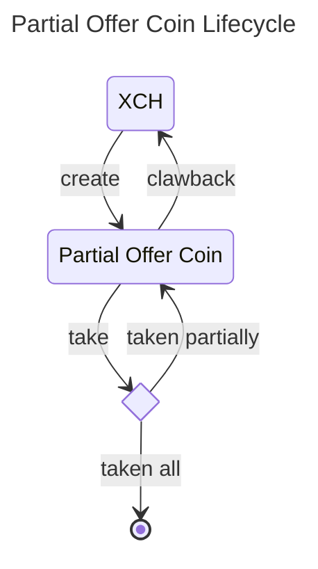

# Partial Offer Coin (PoC)

A dexie partial offer coin is a coin with a puzzle offering one asset (XCH or CAT) for another assert at a fixed exchange rate. A maker can use partial cli to create an offer. The offer can be taken using partial cli with an optional standard Chia offer. The offer can also be clawed back by the maker at any time.

# Design Decisions and Overview
- The partial offer coin is a coin on the blockchain.
- The first partial offer is created by using `partial create` command. When the first offer is created, no new coin is created, but the launcher coin (i.e., the coin creating the first partial offer coin) is locked. When the partial offer is taken, the launcher coin, the first partial offer coin is created, and spent.
- A file containing partial offer information is a non standard bech32 offer file with partial coin spend. The first partial offer also contains the launcher coin spend that creates the first partial offer coin.
- The partial offer can be taken by using `partial take` command.
- When the partial offer is taken partially, the new partial offer coin with the new amount is created.
- The [standard settlement (offer) puzzle](https://chialisp.com/offers/) is utilized to ensure that the assets are exchanged.
- The total amount on the partial offer can be clawed back to the maker by using `partial clawback` command.

# Chialisp

- [partial.clsp](./partial_cli/puzzles/partial.clsp) - The partial offer coin puzzle.
- [fns.clsp](./partial_cli/puzzles/fns.clsp) - The helper functions for the partial offer coin puzzle.

## Parameters
```lisp
  (
        MOD_HASH                ; self puzzle hash 
        FEE_PH                  ; puzzle hash that will receive the fee (XCH puzzle hash)
        FEE_RATE                ; fee rate (0-10000), e.g., 1% is represented as 100
        MAKER_PH                ; maker puzzle hash (XCH puzzle hash used in both receive and clawback)
        CLAWBACK_MOD            ; clawback puzzle
        OFFER_TAIL_HASH         ; offer CAT tail hash (0 if XCH)
        OFFER_MOJOS             ; amount of initial offer in mojos
        REQUEST_TAIL_HASH       ; request CAT tail hash (0 if XCH)
        REQUEST_MOJOS           ; amount of initial request in mojos
        REQUEST_SETTLEMENT_HASH ; settlement puzzle hash of the request coin
        my_amount               ; amount of partial offer coin
        my_id                   ; coin id of the partial offer coin
        my_puzzle_hash          ; puzzle hash of the partial offer coin
        taken_mojos_or_clawback ; amount of mojos taken, or 0 if clawback
        . clawback_solution     ; optional clawback mod solution
    )
```
# Partial CLI commands
```bash
❯ partial --help

 Usage: partial [OPTIONS] COMMAND [ARGS]...

 Manage partial offers

╭─ Options ─────────────────────────────────────────────────────────────────╮
│ --help      Show this message and exit.                                   │
╰───────────────────────────────────────────────────────────────────────────╯
╭─ Commands ────────────────────────────────────────────────────────────────╮
│ clawback        Clawback a partial offer                                  │
│ config          Display the CLI configuration                             │
│ create          Create a partial offer                                    │
│ show            Display a partial offer information                       │
│ take            Take the partial offer                                    │
╰───────────────────────────────────────────────────────────────────────────╯
```

# Samples
- [0.5 TXCH for 171 TDBX](./tests/testnet11/0.5TXCH-x-171TDBX/README.md)
- [5 BYC04 for 1 TXCH](./tests/testnet11/5BYC04-x-1TXCH/README.md)



```mermaid
---
title: Partial Offer Coin Lifecycle
---
stateDiagram-v2
  xch: XCH
  poc: Partial Offer Coin
  state if_state <<choice>>
  xch --> poc: create
  poc --> xch: clawback
  poc --> if_state: take
  if_state --> poc: taken partially
  if_state --> [*]: taken all
```

