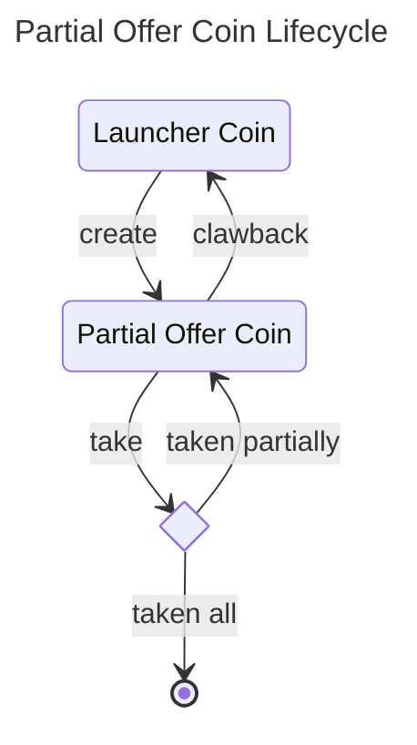

# Partial Offer Coin (PoC)

A dexie partial offer coin is a coin with a puzzle offering one asset (XCH or CAT) for another assert at a fixed exchange rate. A maker can use partial cli to create an offer. The offer can be taken using partial cli with an optional standard Chia offer. The offer can also be clawed back by the maker at any time.

# Design Decisions and Overview
- The partial offer coin is a coin on the blockchain.
- The first partial offer is created by using `partial create` command. When the first offer is created, no new coin is created, but the launcher coin (i.e., the coin creating the first partial offer coin) is locked. When the partial offer is taken, the launcher coin, the first partial offer coin is created, and spent.
- A file containing partial offer information is a non standard bech32 offer file with partial coin spend. The first partial offer also contains the launcher coin spend that creates the first partial offer coin.
- The partial offer can be taken by using `partial take` command.
- When the partial offer is taken partially, the new partial offer coin with the new amount is created.
- The [standard settlement (offer) puzzle](https://chialisp.com/offers/) is utilized to ensure that the assets are exchanged.
- The total amount on the partial offer can be clawed back to the maker by using `partial clawback` command.


```mermaid
---
title: Partial Offer Coin Lifecycle
---
stateDiagram-v2
  launcher: Launcher Coin
  poc: Partial Offer Coin
  state if_state <<choice>>
  launcher --> poc: create
  poc --> launcher: clawback
  poc --> if_state: take
  if_state --> poc: taken partially
  if_state --> [*]: taken all
```

# Chialisp

- [partial.clsp](./partial_cli/puzzles/partial.clsp) - The partial offer coin puzzle.
- [fns.clsp](./partial_cli/puzzles/fns.clsp) - The helper functions for the partial offer coin puzzle.

## Parameters
```lisp
  (
        MOD_HASH                ; self puzzle hash 
        FEE_PH                  ; puzzle hash that will receive the fee (XCH puzzle hash)
        FEE_RATE                ; fee rate (0-10000), e.g., 1% is represented as 100
        MAKER_PH                ; maker puzzle hash (XCH puzzle hash used in both receive and clawback)
        CLAWBACK_MOD            ; clawback puzzle
        OFFER_TAIL_HASH         ; offer CAT tail hash (0 if XCH)
        OFFER_MOJOS             ; amount of initial offer in mojos
        REQUEST_TAIL_HASH       ; request CAT tail hash (0 if XCH)
        REQUEST_MOJOS           ; amount of initial request in mojos
        REQUEST_SETTLEMENT_HASH ; settlement puzzle hash of the request coin
        my_amount               ; amount of partial offer coin
        my_id                   ; coin id of the partial offer coin
        my_puzzle_hash          ; puzzle hash of the partial offer coin
        taken_mojos_or_clawback ; amount of mojos taken, or 0 if clawback
        . clawback_solution     ; optional clawback mod solution
    )
```

## Security and Settlements
- The partial offer uses [the CNI's settlement puzzle](https://chialisp.com/offers/#code) to ensure that the assets are exchanged.
- The partial offer puzzle asserts the taker settlement puzzle announcement using its own name as `nonce`.
- The partial offer puzzle also asserts its own name (i.e., `coin id`), amount, and puzzle hash.

Below is the conditions of [0.25XCH-x-4000SBX sample](https://github.com/dexie-space/partial-cli-beta/blob/main/tests/mainnet/0.25XCH-x-4000SBX/README.md#take) and its associated [xch.events](https://xch.events/transactions/eabb871ef4e11df9b47f9e7855294fcc2d4c4a0842c887d21590fa5a18d4ed86).

- Partial Coin: [`0x71403e46cc37278e0548f6fdaf7365e63e938a0ee34ee9f250fda4f985aafd4c`](https://www.spacescan.io/coin/71403e46cc37278e0548f6fdaf7365e63e938a0ee34ee9f250fda4f985aafd4c)

```lisp
(ASSERT_MY_AMOUNT  0x3a35294400)                                                                                                                              
(ASSERT_MY_COIN_ID  0x71403e46cc37278e0548f6fdaf7365e63e938a0ee34ee9f250fda4f985aafd4c)                            
(ASSERT_MY_PUZZLEHASH  0x619b302523f0ec720fcf729257cf2927be07da2179176500ed2c26e92a63a06b)                         
(ASSERT_PUZZLE_ANNOUNCEMENT  0xefbcfa33bec3cdb077a65fe8de62235c1a8ad55c5add2434f9578405dbe391f0)                   
...
```
- CAT_OFFER_SETTLEMENT: [`0x5cbde2c3969783f4e32376c5225763dba4ed361bec0c42242db3bc96b2dd1aea`](https://www.spacescan.io/coin/5cbde2c3969783f4e32376c5225763dba4ed361bec0c42242db3bc96b2dd1aea)
```lisp
(CREATE_PUZZLE_ANNOUNCEMENT  0x3b2da3f0d012ec55238208737128875a552b985bf182c723c9cf3004975d7021)                   
...
```

## Rate
- The `OFFER_MOJOS` and `REQUEST_MOJOS` values are curried into the puzzle when the partial offer is created and used to calculate the exchange rate when the partial offer is taken.

```lisp
(defun calculate-request-mojos (OFFER_MOJOS REQUEST_MOJOS taken_mojos)
      (/ (* REQUEST_MOJOS taken_mojos) OFFER_MOJOS)
)
```

## Fee
- The fee is calculated based on the curried `FEE_RATE` and the `taken_mojos`.
- `FEE_RATE` value is 0 to 100, e.g., 1% is represented as 100 in the `FEE_RATE`. 
```lisp
(defun calculate-fee-mojos (FEE_RATE taken_mojos)
    (/ (* FEE_RATE taken_mojos) 10000)
) 
```

- For example, if the `FEE_RATE` is 100 (1%), and the taker requests 42000 mojos (XCH or CAT), the fee is 420 mojos which will be deducted from the the amount that taker will receive.

  - [2nd take](./tests/mainnet/500DBX-x-2.5XCH/README.md#2nd-take)

```bash
 0.21 XCH -> 42 DBX
 Sending 0.21 XCH
 Paying 0.42 DBX in fees
 Receiving 41.58 DBX
```

## Clawback
- `CLAWBACK_MOD` is curried into the puzzle when the partial offer is created.
- `CLAWBACK_MOD` is executed with optional `clawback_solution` when the partial offer is clawed back, i.e., `taken_mojos_or_clawback` is 0.
- The [standard clawback puzzle](./partial_cli/puzzles/standard_partial_clawback.clsp) is curried in when creating the partial offer with the cli, i.e., `partial create`.

```lisp
(a CLAWBACK_MOD clawback_solution) 
```

## Blockchain Fees
- For taking the partial offer, the taker can pays the blockchain fees by providing the offer with attached blockchain fees.
- For clawback, the maker pays the blockchain fees. The partial cli will calculate the blockchain fees and attach it to the clawback transaction and link with partial coin spend using `ASSERT_CONCURRENT_SPEND`.


# Partial CLI commands
```bash
❯ partial --help

 Usage: partial [OPTIONS] COMMAND [ARGS]...

 Manage partial offers

╭─ Options ─────────────────────────────────────────────────────────────────╮
│ --help      Show this message and exit.                                   │
╰───────────────────────────────────────────────────────────────────────────╯
╭─ Commands ────────────────────────────────────────────────────────────────╮
│ clawback        Clawback a partial offer                                  │
│ config          Display the CLI configuration                             │
│ create          Create a partial offer                                    │
│ show            Display a partial offer information                       │
│ take            Take the partial offer                                    │
╰───────────────────────────────────────────────────────────────────────────╯
```

# Samples
## testnet11
- [0.5 TXCH for 171 TDBX](./tests/testnet11/0.5TXCH-x-171TDBX/README.md)
- [5 BYC04 for 1 TXCH](./tests/testnet11/5BYC04-x-1TXCH/README.md)
- [10 TDBX for 1 BYC04](./tests/testnet11/10TDBX-x-1BYC04/README.md)

## mainnet
- [0.25 XCH for 4000 SBX](./tests/mainnet/0.25XCH-x-4000SBX/README.md)
- [500 DBX for 2.5 XCH](./tests/mainnet/500DBX-x-2.5XCH/README.md)
- [100 DBX for 7400 SBX](./tests/mainnet/100DBX-x-7400SBX/README.md)

